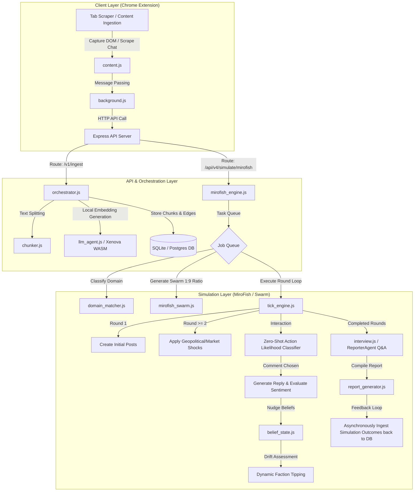

# 🛸 MemTrace & MiroFish Social Simulation Platform

MemTrace is a local-first, privacy-first context extraction, vector index, and graph serialization system. It allows developers to capture active chat history pages or unstructured briefs, chunk them semantic-sensitively, generate local ONNX vector embeddings, and project them into an inspectable Knowledge Graph.

On top of this memory platform, MemTrace layers a multi-agent simulation framework (**MiroFish & Pivot**) to simulate narrative evolution, brand reactions, policy impacts, and financial case studies.

---

## 1. File Modules & Tldr Information

| File Path                                      | Description / Responsibility                                                                                                                                                                  |
| :--------------------------------------------- | :-------------------------------------------------------------------------------------------------------------------------------------------------------------------------------------------- |
| **`api/server.js`**                    | Boots the primary Express server on port `3005`, mounting core middleware (origin checking, authentication) and exposing `/v1/ingest` and `/v1/search`.                                 |
| **`api/pivot_router.js`**              | Exposes router endpoints for Pivot and Swarm simulations, including `/api/v4/simulate/swarm`, job query/cancellation routing, and ReporterAgent interview interactions.                     |
| **`pivot_v4/src/swarm.js`**            | Orchestrates Swarm agent creation. Enforces the strict**1:9 ratio** of general pseudo-archetypes to domain-specific personas, utilizing Pop shuffling to prevent duplicate allocations. |
| **`pivot_v4/src/manifest.js`**         | Serves as the domain and archetype registry. Classifies scenarios into domains (e.g.`TECH`, `FINANCE`) and contains the canonical registry of specialized stakeholder backstories.        |
| **`pivot_v4/src/simulator.js`**        | Orchestrates the Pivot simulation framework, evaluating decision branches (Aggressive, Defensive, Lateral) against stakeholder stances.                                                       |
| **`pivot_v4/src/mirofish_engine.js`**  | Drives Swarm simulation execution. Manages the job queue lifecycle, loads domain profiles, and delegates round-by-round processing.                                                           |
| **`pivot_v4/src/tick_engine.js`**      | Manages the round loop iteration. Applies geopolitical/market shocks, triggers post-generation, and evaluates zero-shot action likelihoods.                                                   |
| **`pivot_v4/src/belief_state.js`**     | Computes agent belief vector drifts and stance updates based on reply sentiment and historical trust decay.                                                                                   |
| **`pivot_v4/src/scoring.js`**          | Calculates quantitative confidence metrics, faction stance convergence, and alignment indices.                                                                                                |
| **`pivot_v4/src/report_generator.js`** | Compiles the final simulation Markdown report summarizing risks, key actors, round logs, and confidence readouts.                                                                             |
| **`extension/content.js`**             | Chrome Content Script. Scrapes the active tab's chat logs or article text and sends the raw text payload to the extension background script.                                                  |
| **`extension/background.js`**          | Chrome Background Script. Manages runtime state, communicates with `popup.js`, and relays scraped data to the local Express API server.                                                     |
| **`extension/popup.js`**               | Chrome Extension Popup. Provides the user interface displaying ingestion progress and simulation controls.                                                                                    |
| **`local_llm_server.ipynb`**           | FastAPI server running HuggingFace transformers (`unsloth/Qwen3-0.6B`) locally to perform offline generation.                                                                               |

---

## 2. High-Level Architectural Flow



---

## 3. Project Overview & Core Mechanics

MemTrace acts as a **persistent context substrate**. It converts temporary chat details into permanently cached embeddings and graph nodes, ensuring historical workspace threads remain queryable across new LLM contexts.

### How Swarm Simulation Works:

1. **Ingestion & Graph Projection**: Scraped context is projected into an ontology graph containing faction nodes.
2. **Dynamic Swarm Allocation**: The system dynamically matched the context topic to a domain (e.g. `TECH`) and generates a population of agents following a strict **1:9 ratio** (90% domain-specific personas, 10% general critical personas like *The Builder* or *The Skeptic*) to avoid echo-chamber behavior.
3. **Stochastic Round Tick**: The engine runs 3 simulation rounds:
   - *Round 1*: Agents write initial posts showing their default faction stances.
   - *Round 2*: External shocks (e.g., policy updates, market spikes) are applied. Agents react.
   - *Round >=3*: Pairwise social interactions (likes, comments, follows) run. Edges and beliefs shift based on zero-shot action probabilities and reply sentiment.
4. **Defection**: Agents whose stances drift too far from their bound faction defect dynamically.
5. **ReporterAgent Interviews**: Users can chat directly with individual agents post-simulation to inspect their rationales.
6. **Grounding**: The final simulation report is ingested back into MemTrace, making the outcome searchable in future sessions.

---

## 4. Usage, Installation & API Reference

### A. Prerequisites & Local LLM Server Setup

1. **Python Dependencies**:

   ```bash
   pip install torch transformers fastapi uvicorn pydantic nest-asyncio accelerate
   ```
2. **Boot the Local Server**:
   Open a terminal and run:

   ```bash
   jupyter nbconvert --to script local_llm_server.ipynb
   python3 local_llm_server.py
   ```

   *The server loads Qwen3-0.6B and listens on `http://127.0.0.1:8000/generate`.*

### B. Core API server Setup

1. **Install Dependencies**:

   ```bash
   npm install
   ```
2. **Start the API Server**:

   ```bash
   npm run dev
   ```

   *The Express server boots on `http://127.0.0.1:3005`.*
3. **Running the Test Suite**:

   ```bash
   ./test/run_tests_v2.sh
   ```

---

### C. API Endpoint Documentation

#### 1. Ingest Text Context

- **Endpoint**: `POST /v1/ingest`
- **Headers**: `Content-Type: application/json`
- **Request Payload**:

```json
{
  "text": "The company has announced a shift towards fully remote work. While developers are excited, operations teams are raising concerns about shipping physical assets.",
  "reference": "https://company.internal/policy/work-location-memo",
  "uuid": "43e24522-9a75-43f0-83f9-48b3ca18cb6f"
}
```

- **Response Payload**:

```json
{
  "status": "success",
  "chunks_ingested": 2,
  "edges_created": 1,
  "reference_id": "43e24522-9a75-43f0-83f9-48b3ca18cb6f"
}
```

#### 2. Search Ingested Context

- **Endpoint**: `POST /v1/search`
- **Request Payload**:

```json
{
  "query": "remote work policy concerns",
  "limit": 5
}
```

- **Response Payload**:

```json
{
  "query": "remote work policy concerns",
  "results": [
    {
      "chunk": "operations teams are raising concerns about shipping physical assets...",
      "score": 0.88,
      "reference": "https://company.internal/policy/work-location-memo"
    }
  ]
}
```

#### 3. Trigger Swarm Simulation

- **Endpoint**: `POST /api/v4/simulate/swarm`
- **Request Payload**:

```json
{
  "scenario": "How will our launch of the decentralized storage protocol affect enterprise compliance teams?",
  "rounds": 3,
  "agentCount": 12,
  "uuid": "bf8c5477-1084-44f0-b00f-35e3a6664138"
}
```

- **Response Payload**:

```json
{
  "status": "enqueued",
  "jobId": "job_1717012345678",
  "message": "Swarm simulation enqueued successfully."
}
```

#### 4. Get Swarm Job Status

- **Endpoint**: `GET /api/v4/jobs-swarm/:id`
- **Response Payload**:

```json
{
  "jobId": "job_1717012345678",
  "status": "completed",
  "progress": 100,
  "result": {
    "report": "# Swarm Simulation Report\n## Dominant Risk: Compliance friction...",
    "roundsCompleted": 3,
    "confidenceIndex": 0.76
  }
}
```

#### 5. Chat with Swarm Agent (ReporterAgent Mode)

- **Endpoint**: `POST /api/v4/swarm/:simId/agent/:agentId/chat`
- **Request Payload**:

```json
{
  "message": "Why did you vote to defect from the Enterprise faction in Round 2?"
}
```

- **Response Payload**:

```json
{
  "agentId": "CyberSecurity_5",
  "response": "The compliance memo introduced excessive friction for security key rotation, making my alignment with the Enterprise baseline indefensible."
}
```

---

## 5. MiroFish Landing Page Copy & Structural Assets

To enable rapid deployment of a landing page frontend, we have structured the complete copywriting assets, playbooks, prompts, and research frameworks directly below:

### A. The Core Scenario Gallery

Use these templates to configure scenario routing on the landing page UI:

1. **Public Opinion (Narrative Escalation Map)**

   - *Description*: Model how institutions, media, influencers, and observers reshape the first narrative around an incident.
   - *Typical Input*: Incident brief + policy memo.
   - *MemTrace Integration*: Parses the incident brief into a graph structure where node weights determine narrative dominance.
2. **Launch Reaction (Top Misunderstanding Risk)**

   - *Description*: Stress-test product messaging before competitors, users, and commentators interpret the launch for you.
   - *Typical Input*: Launch brief + FAQ.
   - *MemTrace Integration*: Measures stance divergence to highlight how external actors are likely to misinterpret specific messaging points.
3. **Policy Impact (Downstream Pressure Analysis)**

   - *Description*: Inspect how different stakeholder groups interpret a draft policy once incentives and compliance pressure collide.
   - *Typical Input*: Policy draft + stakeholder notes.
   - *MemTrace Integration*: Models faction dynamics showing where compliance incentives trigger opposing alliances.
4. **Brand Crisis (Crisis Response Gap)**

   - *Description*: See how a fragile launch or reputational event expands when the public question drifts away from internal intent.
   - *Typical Input*: Risk memo + response plan.
   - *MemTrace Integration*: Simulates three rounds of public escalation to identify vulnerabilities in the response strategy.
5. **Finance Case (Sentiment Divergence Summary)**

   - *Description*: Run a market-facing scenario where management, analysts, and retail narratives react to the same financial signal differently.
   - *Typical Input*: Earnings note + market context.
   - *MemTrace Integration*: Sets up distinct corporate and retail faction nodes with varying access to simulated market news feeds.
6. **Literary Continuation (Character Pressure Graph)**

   - *Description*: Treat a fictional world as a live graph of motives and memory, then test how one new event changes the story.
   - *Typical Input*: Narrative chapter + continuation brief.
   - *MemTrace Integration*: Models narrative continuity by reading character files and mapping changes in relationships as graph edges.

### B. Interactive Simulation Dashboard Components

The interface should expose three visual tabs:

- **Graph View**: Visualizes the scenario ontology as a live node-edge network mapping faction stances and dynamic trust edges.
- **Simulation View**: Displays a real-time feed of multi-agent social interactions (posts, comments, follows) updating round-by-round.
- **Report View**: Provides the compiled Markdown intelligence summary containing deterministic scoring indexes.

### C. Executive readouts & Prompts

- **Dominant Risk Summary**: Compresses predicted trajectories into concise readouts (e.g., *Sustained trust erosion from delayed response*).
- **Key Actors Indicator**: Highlights nodes whose influence scores mutate fastest (e.g., *Narrative drivers outrun formal clarification*).
- **Prompt Recipe Library**:
  - *Public Opinion Forecast*: "Forecast how the uploaded incident evolves across public platforms, who amplifies it first, and what response slows trust erosion over three rounds."
  - *Launch Stress Test*: "Simulate how customers, competitors, and commentators react to this launch brief, and identify the most expensive misunderstanding if left unanswered."
  - *Policy Reaction*: "Simulate how institutions, affected groups, and public commentators interpret this policy draft, and identify the largest downstream pressure."
  - *Narrative Continuation*: "Simulate how this narrative world evolves after the new event, which characters gain influence first, and what tension changes the final outcome."

### D. Trust & Research Framework

- **What MiroFish Simulates**: Actor incentives, motive conflict, platform-native narrative spread, and sequential round effects.
- **What Remains Human**: Choosing the scenario boundary, inspecting graph completeness (missing pressure), and making high-stakes operating calls.
- **Epistemic Approach**: Forecasts are treated as inspectable hypotheses and reviewable evidence, not absolute certainty.

---

## 6. Upgrades & Deployment Publishing Guide

To publish MemTrace as a public, production-grade web application:

```
                  +--------------------------------+
                  |    Nginx Reverse Proxy / SSL   |
                  +---------------+----------------+
                                  |
            +---------------------+---------------------+
            | (Port 80/443)                             | (Port 8000)
            v                                           v
+-----------------------+                    +---------------------+
| Express API Server    |                    | Local LLM Sidecar   |
| (Node.js Cluster)     |                    | (FastAPI / CUDA)    |
+-----------+-----------+                    +----------+----------+
            |                                           |
            +---------------------+---------------------+
                                  | (Internal Network)
                                  v
                    +-----------------------------+
                    | Postgres DB (Multi-Tenant)  |
                    +-----------------------------+
```

### Next Steps for Production:

1. **Database Migration**: Swap SQLite for a PostgreSQL instance. Update standard node configurations to pool queries concurrently.
2. **Reverse Proxying**: Use Nginx to expose `/api/v4/simulate/swarm` externally, routing HTTPS queries with secure headers.
3. **Frontend Publishing**: Build the user-facing webapp dashboard with a modern component library, binding real-time state hooks to the Express API. Expose the **Scenario Gallery** templates using pre-loaded JSON contexts.

---

Similar companies: Similate ai, Simfolk, User Intuition, SYMAR, and Delve AI
https://societies.io/
https://www.similate.ai/
https://www.symar.ai/
https://simfolk.ai/

---

A/B testing

PersonaMatrix
DecisionPilot
Pathfinder AI
MindWeave
SimSphere
Cognitive Mesh
Memtrace
Consensus AI

Example:

Before sending an email:

<pre class="overflow-visible! px-0!" data-start="2265" data-end="2303"><div class="relative w-full mt-4 mb-1"><div class=""><div class="relative"><div class="h-full min-h-0 min-w-0"><div class="h-full min-h-0 min-w-0"><div class="border border-token-border-light border-radius-3xl corner-superellipse/1.1 rounded-3xl"><div class="h-full w-full border-radius-3xl bg-token-bg-elevated-secondary corner-superellipse/1.1 overflow-clip rounded-3xl lxnfua_clipPathFallback"><div class="pointer-events-none absolute end-1.5 top-1 z-2 md:end-2 md:top-1"></div></div></div></div></div></div></div></div></pre>

<pre class="overflow-visible! px-0!" data-start="2265" data-end="2303"><div class="relative w-full mt-4 mb-1"><div class=""><div class="relative"><div class="h-full min-h-0 min-w-0"><div class="h-full min-h-0 min-w-0"><div class="border border-token-border-light border-radius-3xl corner-superellipse/1.1 rounded-3xl"><div class="h-full w-full border-radius-3xl bg-token-bg-elevated-secondary corner-superellipse/1.1 overflow-clip rounded-3xl lxnfua_clipPathFallback"><div class="relative"><div class="pe-11 pt-3"><div class="relative z-0 flex max-w-full"><div id="code-block-viewer" dir="ltr" class="q9tKkq_viewer cm-editor z-10 light:cm-light dark:cm-light flex h-full w-full flex-col items-stretch ͼs ͼ16"><div class="cm-scroller"><pre class="cm-content q9tKkq_readonly m-0"><code><span>Simulate likely reactions.</span></code></pre></div></div></div></div></div></div></div></div></div><div class=""><div class=""></div></div></div></div></div></pre>

Before a sales call:

<pre class="overflow-visible! px-0!" data-start="2327" data-end="2359"><div class="relative w-full mt-4 mb-1"><div class=""><div class="relative"><div class="h-full min-h-0 min-w-0"><div class="h-full min-h-0 min-w-0"><div class="border border-token-border-light border-radius-3xl corner-superellipse/1.1 rounded-3xl"><div class="h-full w-full border-radius-3xl bg-token-bg-elevated-secondary corner-superellipse/1.1 overflow-clip rounded-3xl lxnfua_clipPathFallback"><div class="pointer-events-none absolute end-1.5 top-1 z-2 md:end-2 md:top-1"></div></div></div></div></div></div></div></div></pre>

<pre class="overflow-visible! px-0!" data-start="2327" data-end="2359"><div class="relative w-full mt-4 mb-1"><div class=""><div class="relative"><div class="h-full min-h-0 min-w-0"><div class="h-full min-h-0 min-w-0"><div class="border border-token-border-light border-radius-3xl corner-superellipse/1.1 rounded-3xl"><div class="h-full w-full border-radius-3xl bg-token-bg-elevated-secondary corner-superellipse/1.1 overflow-clip rounded-3xl lxnfua_clipPathFallback"><div class="relative"><div class="pe-11 pt-3"><div class="relative z-0 flex max-w-full"><div id="code-block-viewer" dir="ltr" class="q9tKkq_viewer cm-editor z-10 light:cm-light dark:cm-light flex h-full w-full flex-col items-stretch ͼs ͼ16"><div class="cm-scroller"><pre class="cm-content q9tKkq_readonly m-0"><code><span>Simulate objections.</span></code></pre></div></div></div></div></div></div></div></div></div><div class=""><div class=""></div></div></div></div></div></pre>

Before hiring:

<pre class="overflow-visible! px-0!" data-start="2377" data-end="2412"><div class="relative w-full mt-4 mb-1"><div class=""><div class="relative"><div class="h-full min-h-0 min-w-0"><div class="h-full min-h-0 min-w-0"><div class="border border-token-border-light border-radius-3xl corner-superellipse/1.1 rounded-3xl"><div class="h-full w-full border-radius-3xl bg-token-bg-elevated-secondary corner-superellipse/1.1 overflow-clip rounded-3xl lxnfua_clipPathFallback"><div class="pointer-events-none absolute end-1.5 top-1 z-2 md:end-2 md:top-1"></div></div></div></div></div></div></div></div></pre>

<pre class="overflow-visible! px-0!" data-start="2377" data-end="2412"><div class="relative w-full mt-4 mb-1"><div class=""><div class="relative"><div class="h-full min-h-0 min-w-0"><div class="h-full min-h-0 min-w-0"><div class="border border-token-border-light border-radius-3xl corner-superellipse/1.1 rounded-3xl"><div class="h-full w-full border-radius-3xl bg-token-bg-elevated-secondary corner-superellipse/1.1 overflow-clip rounded-3xl lxnfua_clipPathFallback"><div class="relative"><div class="pe-11 pt-3"><div class="relative z-0 flex max-w-full"><div id="code-block-viewer" dir="ltr" class="q9tKkq_viewer cm-editor z-10 light:cm-light dark:cm-light flex h-full w-full flex-col items-stretch ͼs ͼ16"><div class="cm-scroller"><pre class="cm-content q9tKkq_readonly m-0"><code><span>Simulate team dynamics.</span></code></pre></div></div></div></div></div></div></div></div></div><div class=""><div class=""></div></div></div></div></div></pre>

Before posting:

<pre class="overflow-visible! px-0!" data-start="2431" data-end="2477"><div class="relative w-full mt-4 mb-1"><div class=""><div class="relative"><div class="h-full min-h-0 min-w-0"><div class="h-full min-h-0 min-w-0"><div class="border border-token-border-light border-radius-3xl corner-superellipse/1.1 rounded-3xl"><div class="h-full w-full border-radius-3xl bg-token-bg-elevated-secondary corner-superellipse/1.1 overflow-clip rounded-3xl lxnfua_clipPathFallback"><div class="pointer-events-none absolute end-1.5 top-1 z-2 md:end-2 md:top-1"></div></div></div></div></div></div></div></div></pre>

```
Simulate audience interpretations.
```

---


---
