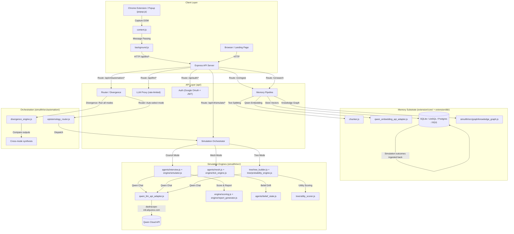
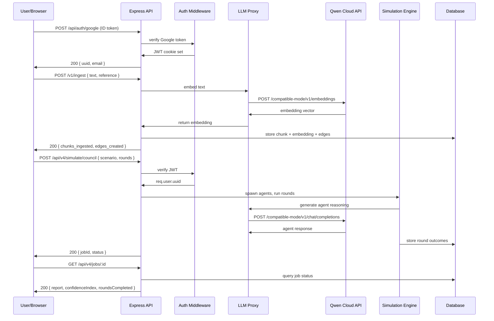

# 🧠 Simulith / MemTrace — Multi-Agent Simulation Platform

**Powered by Qwen Cloud — Built for the Global AI Hackathon Series**

---

## TL;DR

Simulith is a multi-agent simulation engine that lets you **stress-test decisions before they meet reality**. Feed it a policy draft, launch brief, crisis memo, or video — it spawns autonomous AI agents (personas, stakeholders, commentators) who deliberate, react, factionalize, and drift across configurable simulation rounds. Three modes — **Council** (structured deliberation), **Mesh** (social belief dynamics), **Tree** (causal consequence search) — each reveal different failure modes. An **Orchestrator** layer (Router / Divergence) auto-selects or runs all three simultaneously and surfaces where they disagree. Underneath is a persistent **memory substrate** (ingestion → chunking → embedding → knowledge graph) that makes every simulation outcome searchable context for future queries. Built on Qwen Cloud LLM + Embedding APIs, deployed on Alibaba Cloud SAS.

**Live at**: [simulith.hazeezadebayo.dev](https://simulith.hazeezadebayo.dev)

---

## The Pitch

### Decisions have consequences. Most teams discover them too late.

Every high-stakes decision — a product launch, a policy change, a crisis response — creates a wave of reactions across stakeholders, markets, and commentators. Most teams rely on intuition, focus groups, or a single LLM call that collapses ambiguity into one confident answer.

**Simulith treats uncertainty as the output.**

Instead of one answer, you get a **simulation report** showing:
- **Council**: A panel of generated persona agents debates your decision across strategic branches (Aggressive, Defensive, Lateral) and returns a mathematical confidence index for each path.
- **Mesh**: Up to 30 autonomous agents form factions, react to shocks, drift in beliefs, and defect — showing how narratives evolve across social landscapes.
- **Tree**: An MCTS-inspired engine maps every decision into a branching tree of causally linked outcomes, scored by deterministic physics and stochastic variance.

A **Router** auto-selects the best-fit mode. **Divergence** runs all three and highlights where they conflict — because disagreement *is* the signal.

### Why Qwen Cloud?

Every LLM call — summarization, embedding, tag generation, agent reasoning, belief drift computation — runs through **Qwen Cloud APIs** (`qwen3.7-plus`, `qwen-embedding`). The system is designed to be Qwen-native: if the API key is present, the full simulation stack activates. No external LLM dependencies.

---

## Hackathon Fit

### Tracks Entered

| Track | Coverage |
|-------|----------|
| **MemoryAgent** | Persistent, structured memory substrate: chunking → embedding (Qwen) → knowledge graph → cross-session recall. Every simulation outcome is ingested back for future queries. |
| **Agent Society** | Three multi-agent architectures (Council, Mesh, Tree) with autonomous agents that deliberate, factionalize, compete, and drift. Router/Divergence orchestrator coordinates across modes. |
| **Autopilot Agent** | Router auto-selects simulation mode from user intent. Divergence runs all three autonomously. End-to-end pipeline from ingestion to report with zero manual routing. |

### Submission Checklist

| Requirement | Status |
|-------------|--------|
| Public GitHub repository with open-source license | ✅ MIT License |
| Architecture diagram (Mermaid flowchart) | ✅ See Section 2 |
| Written summary of features & functionality | ✅ This document |
| Proof of Alibaba Cloud Deployment | ✅ Deployed on Alibaba SAS (Singapore), Cloudflare Tunnel |
| 1–3 minute demo video | ✅ Submitted |
| Open-source frameworks OK; no direct repo cloning | ✅ Built from scratch |

---

## What We Built

### Memory Substrate (`extension/core/`, `extension/db/`)

Files: `memory.js`, `chunker.js`, `orchestrator.js`, `sqlite-adapter.js`, `postgres-adapter.js`, `remote-adapter.js`, `alibaba_cloud_rds_adapter.js`

- **Ingestion pipeline**: Raw text → semantic chunking → Qwen embedding → vector storage → knowledge graph edges
- **Multi-backend**: SQLite (local WASM), LibSQL (Turso), PostgreSQL, Alibaba Cloud ApsaraDB (RDS)
- **Cross-session memory**: Every simulation outcome is ingested back, building a living library of tested assumptions

### Simulation Modes (`simulith/src/`)

| Mode | File(s) | Description |
|------|---------|-------------|
| **Council** | `agents/interview.js`, `agents/generative.js`, `engine/scoring.js`, `engine/simulator.js` | Stakeholder panel deliberation with strategic branching and confidence scoring |
| **Mesh** | `agents/mesh.js`, `agents/belief_state.js`, `data/shocks.js`, `engine/tick_engine.js` | Multi-agent social simulation with faction formation, belief drift, and defection |
| **Tree** | `tree/tree_builder.js`, `tree/transition_engine.js`, `tree/probability_engine.js`, `tree/utility_scorer.js`, `tree/perturbation_engine.js` | MCTS-inspired consequence state-space search with deterministic physics scoring |

### Orchestration Layer (`api/automation_router.js`, `simulith/src/automation/`)

- **Router**: LLM analyzes user intent and auto-dispatches to optimal simulation mode
- **Divergence**: Runs all three modes simultaneously on the same question and compares outputs
- **Synthesis**: Cross-mode confidence scoring with disagreement highlighting

### API & Auth (`api/`)

Files: `memtrace_server.js`, `auth_server.js`, `auth_secret.js`, `council_server.js`, `mesh_server.js`, `tree_server.js`, `simulith_server.js`, `persona_server.js`, `telemetry_server.js`, `core_memory_server.js`, `db_users.js`

- **Google OAuth 2.0** login with JWT session management (HttpOnly cookies)
- **Rate-limited LLM proxy endpoints** (`/api/llm/summarize`, `/tags`, `/embed`, `/generate-answer`) — API keys stay server-side
- **User token accounting** with rate limiting and injection guardrails
- **Admin endpoints** for user management, token requests, and system stats

### Chrome Extension (`extension/`)

Files: `popup.js`, `content.js`, `background.js`, `popup.html`, `manifest.json`

- Captures active tab content (chat logs, articles, documents)
- Communicates with the Express API for ingestion and simulation
- Bundled via esbuild with WASM SQLite for offline-capable operation

### Qwen Cloud Integration (`extension/llm/`)

Files: `qwen_llm_api_adapter.js`, `qwen_embedding_api_adapter.js`, `llm_agent.js`, `agent.js`, `embedding.js`

- **Chat completion**: `qwen3.7-plus` / `qwen3.7-max` for agent reasoning, summarization, tag generation
- **Embeddings**: Qwen Embedding API for vector generation
- **Fallback chain**: Qwen → OpenAI → Gemini, configured per-provider
- **Rate limiting**: Token bucket + sliding window IP limiter (10 req/min per IP for LLM endpoints)
- **Server-side proxy**: API keys never exposed to the browser

---

## Judging Criteria Assessment

### Innovation & AI Creativity (30%)

> *Architecture quality, modularity, scalability, error handling, clean code, non-trivial logic, sophisticated tech stack*

- **Three independent simulation modes** (Council / Mesh / Tree) with a shared orchestrator — each mode is a novel approach to multi-agent reasoning
- **Router + Divergence pattern**: Rather than committing to one simulation strategy, the system either auto-selects or runs all three simultaneously and surfaces disagreement
- **Memory substrate as first-class citizen**: Not just a chatbot with RAG — every simulation outcome is ingested into a persistent knowledge graph, making past forecasts context for future queries
- **Sophisticated tech stack**: Express + SQLite/LibSQL/Postgres multi-backend + Qwen Cloud APIs + esbuild bundling + Docker deployment + Alibaba Cloud + Cloudflare Tunnel

### Technical Depth & Engineering (30%)

> *Sophisticated use of QwenCloud APIs, algorithmic/engineering innovation, custom components, performance optimization*

- **Qwen-native architecture**: Every LLM call uses Qwen Cloud APIs (`qwen3.7-plus`, `qwen-embedding`). The `qwen_llm_api_adapter.js` and `qwen_embedding_api_adapter.js` provide dedicated Qwen integration with proper error handling and retry logic
- **Custom simulation engines**: Tree mode implements MCTS-inspired state-space search with deterministic physics (elasticity, coupling, shocks) and stochastic variance — not a wrapper around an existing library
- **Server-side LLM proxy**: All API keys stay on the server. The extension's popup communicates through authenticated, rate-limited proxy endpoints (`/api/llm/*`) — meaning Qwen API keys are never exposed to client-side JavaScript
- **Multi-tier rate limiting**: Token bucket per-user + sliding window per-IP (10 req/min) + global 500 req/min — costing is controlled at three independent levels
- **Performance optimizations**: 1.5MB esbuild bundle with WASM SQLite, 1h CDN cache with cache-busting `?v=N`, 700MB container memory limit with swap support

### Problem Value & Impact (25%)

> *Real-world relevance, scalability potential for productization or community adoption*

- **Real pain point**: Teams routinely make high-stakes decisions without simulating how stakeholders, markets, and commentators will react. Simulith provides a systematic, repeatable process for surfacing failure modes before they materialize
- **Industry-agnostic**: Equally applicable to product launches, policy analysis, crisis comms, narrative forecasting, and strategic planning
- **Scalable architecture**: Multi-backend storage (SQLite → Postgres → RDS), Docker containerization, Cloudflare CDN, Alibaba Cloud SAS — designed for production from day one
- **Open-source MIT license**: Community can self-host, extend, and integrate

### Presentation & Documentation (15%)

> *Clear technical demo, visualized key logic, architecture docs*

- ✅ Architecture diagram (Mermaid flowchart — see Section 2)
- ✅ Deployed live instance at [simulith.hazeezadebayo.dev](https://simulith.hazeezadebayo.dev)
- ✅ Video demo submitted
- ✅ This document

---

## Architecture



### Request Flow



---

## Quick Start

### Prerequisites

- Node.js 20+
- Docker & Docker Compose (for production deployment)
- Qwen Cloud API key (sign up at [qwencloud.com](https://qwencloud.com))

### Local Development

```bash
# Install dependencies
cd memtrace && npm install

# Set environment variables
export API_KEY="sk-your-qwen-api-key"
export GOOGLE_CLIENT_ID="your-google-client-id"  # optional for local dev
export JWT_SECRET="your-256-bit-secret"           # optional, auto-generated

# Build popup bundle (optional, for Chrome extension)
npm run build:popup

# Start server
npm run dev
```

Server boots at `http://localhost:3106`.

### Docker Deployment

```bash
# Build production image
docker build -f docker/Dockerfile.prod -t memtrace .

# Run
docker run -d \
  --name memtrace \
  -p 3106:3106 \
  -e API_KEY="sk-your-qwen-api-key" \
  -e GOOGLE_CLIENT_ID="your-google-client-id" \
  -v memtrace_data:/app/data \
  memtrace
```

### Environment Variables

| Variable | Required | Description |
|----------|----------|-------------|
| `API_KEY` | Yes | Qwen Cloud API key (sk-...) |
| `LLM_PROVIDER` | No | LLM provider (`qwen`, `openai`, `gemini`) — default `qwen` |
| `LLM_MODEL` | No | Model name — default `qwen-turbo` |
| `EMB_PROVIDER` | No | Embedding provider — default `qwen` |
| `GOOGLE_CLIENT_ID` | No | Google OAuth client ID (required for login) |
| `JWT_SECRET` | No | JWT signing secret (auto-generated if absent) |
| `PORT` | No | Server port — default `3106` |
| `NODE_ENV` | No | `production` or `development` |
| `DB_TYPE` | No | Database backend — `offline` (SQLite), `turso`, `postgres` |
| `LIMIT_*` | No | Simulation limits (agents, rounds, ticks) |

---

## API Reference

### Authentication

| Endpoint | Method | Description |
|----------|--------|-------------|
| `/api/auth/google` | POST | Login with Google ID token |
| `/api/auth/me` | GET | Get current user profile (requires auth) |
| `/api/auth/logout` | POST | Clear session |

### LLM Proxy (authenticated, rate-limited)

| Endpoint | Method | Description |
|----------|--------|-------------|
| `/api/llm/summarize` | POST | Summarize text via Qwen |
| `/api/llm/tags` | POST | Generate tags via Qwen |
| `/api/llm/embed` | POST | Generate embedding via Qwen |
| `/api/llm/generate-answer` | POST | Generate answer with context |
| `/api/llm/config` | GET | Get LLM provider config (public) |

### Simulation

| Endpoint | Method | Description |
|----------|--------|-------------|
| `/api/v4/simulate/council` | POST | Run Council deliberation |
| `/api/v4/simulate/mesh` | POST | Run Mesh social simulation |
| `/api/v4/simulate/tree` | POST | Run Tree consequence search |
| `/api/v4/simulate/memtrace` | POST | Run MemTrace mode |
| `/api/v4/jobs/:id` | GET | Get simulation job status/results |
| `/api/v4/jobs/:id` | DELETE | Cancel simulation |

### Memory

| Endpoint | Method | Description |
|----------|--------|-------------|
| `/v1/ingest` | POST | Ingest text into memory |
| `/v1/search` | POST | Search ingested memory |
| `/v1/thread` | GET | Get thread state |
| `/v1/chunk` | POST | Create chunk |
| `/v1/chunk/:id` | GET/PUT/DELETE | CRUD operations on chunks |

### Automation

| Endpoint | Method | Description |
|----------|--------|-------------|
| `/api/v4/automation/router` | POST | Auto-select and run simulation mode |
| `/api/v4/automation/divergence` | POST | Run all modes and compare |
| `/api/v4/automation/status` | GET | Get automation status |

---

## Deployment

Deployed on **Alibaba Cloud Simple Application Server (SAS)** — Singapore region, 896MB RAM, 1GB swap.

- **Container**: Docker via GHCR (GitHub Container Registry)
- **CI/CD**: GitHub Actions → build image → push to GHCR → SSH into SAS → docker-compose pull & up
- **Tunnel**: Cloudflare Tunnel (no open ports besides 80/443 via Cloudflare proxy)
- **Database**: SQLite (offline mode) on persistent Docker volume
- **Cache**: Cloudflare CDN caches extension bundle for 1h, cache-bust with `?v=N`

### Architecture

```
GitHub Push → GitHub Actions → Build Docker Image → Push to GHCR
                                                       ↓
                                           Alibaba SAS (docker-compose pull)
                                                       ↓
                                           Cloudflare Tunnel → Public Internet
```

---

## License

MIT — see [LICENSE](memtrace/LICENSE)

## Repository

[github.com/hazeezadebayo/memtrace-simulith](https://github.com/hazeezadebayo/memtrace-simulith)
