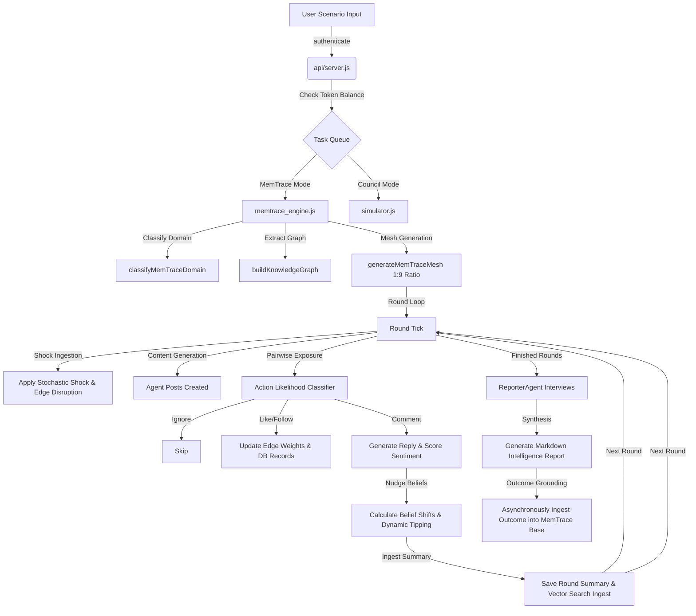
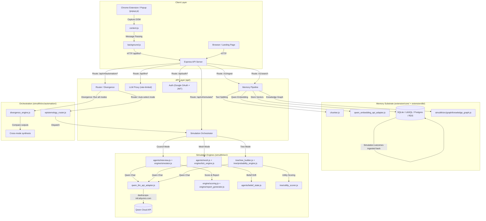

# 🧠 MemTrace & Simulith — Multi-Agent Simulation & Context-Retrieval Platform

**Powered by Qwen Cloud — Built for the Global AI Hackathon Series**

---

## 1. Introduction and Purpose

**MemTrace** is a production-grade, local-first context-retrieval and serialization engine. It is designed to capture unstructured text from browser-based session threads and web sources, segment it into boundary-aware chunks, and compile it into an active, semantic **Knowledge Graph** utilizing local vector embeddings.

**Simulith** is a multi-agent simulation engine sitting directly atop the MemTrace context substrate. Instead of generating isolated, one-off social or decision models, it integrates the captured facts into a persistent, multi-agent environment where up to 30 custom-tailored agents (representing distinct factions or interests) deliberate, interact, and generate predictive forecast readouts. Every simulation round and final outcome is ingested directly back into the vector database, enabling a continuous memory-driven learning loop.

With Simulith, teams can **stress-test decisions before they meet reality**. Feed it a policy draft, launch brief, crisis memo, or video — it spawns autonomous AI agents (personas, stakeholders, commentators) who deliberate, react, factionalize, and drift across configurable simulation rounds.

Three modes — **Council** (structured deliberation), **Mesh** (social belief dynamics), and **Tree** (causal consequence search) — each reveal different failure modes. An **Orchestrator** layer (Router / Divergence) auto-selects or runs all three simultaneously and surfaces where they disagree. Underneath is a persistent **memory substrate** (ingestion → chunking → embedding → knowledge graph) that makes every simulation outcome searchable context for future queries. Built on Qwen Cloud LLM + Embedding APIs, deployed on Alibaba Cloud SAS.

---

## 2. Core Concept & Key Features

### The Pitch

Every high-stakes decision — a product launch, a policy change, a crisis response — creates a wave of reactions across stakeholders, markets, and commentators. Most teams rely on intuition, focus groups, or a single LLM call that collapses ambiguity into one confident answer.

**Simulith treats uncertainty as the output.** Instead of one answer, you get a simulation report showing how different agent structures polarization, belief drift, and causal branching pathways unfold.

### What MemTrace Is

MemTrace is a **multi-agent social simulation platform** that spawns autonomous LLM-driven agents, runs them through structured interaction rounds, and measures emergent properties: belief drift, faction formation, consensus polarization, and decision confidence. It operates in three distinct simulation modes — Council, Mesh, and Tree — each with its own engine.

Three separate LLM call patterns power the system:

* **Generative LLM calls**: Agent backstories, posts, replies, branch proposals, cross-examinations.
* **Classification LLM calls**: Domain detection, sentiment scoring, edge sentiment, stance extraction.
* **Deterministic math**: Transition physics, elasticity models, probability softmax, scoring heuristics.

### Simulation Modes

| Mode              | Description                                                                                                                                                                 |
| :---------------- | :-------------------------------------------------------------------------------------------------------------------------------------------------------------------------- |
| **Mesh**    | Multi-round social simulation. Agents publish posts, react to shocks, form factions, and drift beliefs across simulated platforms (Twitter, Reddit, HN, Discord, Facebook). |
| **Council** | Strategic option evaluation. Personas debate decision branches (Aggressive, Defensive, Lateral). Mathematical scoring model computes confidence ratings.                    |
| **Tree**    | Monte Carlo Tree Search. LLM generates semantic operators, deterministic physics engine evaluates state transitions with pruning.                                           |

### Core Key Features

* **Intelligent Chunking**: Splits text into ~5,000 words per chunk using LLM-refined semantic boundaries without mid-sentence breaks.
* **Semantic Vector Search**: Graph-powered vector search finds related ideas. Traverses edges by similarity using embeddings from local Xenova or Qwen Cloud APIs.
* **Multi-Platform Synchronization**: Captures context from Grok, ChatGPT, Claude, etc., allowing seamless transfer and continuation across tools.
* **Interactive Agent Interviews**: Direct, interactive post-simulation chat and stakeholder cross-examinations via a `ReporterAgent`.
* **Zero-Shot Action Likelihood Engine**: Light probabilistic action sampling reduces LLM writing actions by 70%, optimizing tokens.
* **Continuous Memory Loop**: Simulation reports are ingested back into the SQLite/Postgres database as new context nodes.
* **Offline Mode**: Full local capabilities using browser-based SQLite WASM and local models (via `@xenova/transformers`).

---

## 3. Folder Structure

```
memtrace/
├── api/                       # API Server & Backend Logic
│   ├── server.js              # Express Server Entry
│   ├── auth.js                # Authentication Middleware
│   ├── auth_server.js         # Google OAuth & Session Management
│   ├── core_memory_server.js  # Memory substrate routes
│   ├── council_server.js      # Council simulation endpoints
│   ├── mesh_server.js         # Mesh simulation endpoints
│   ├── tree_server.js         # Tree simulation endpoints
│   ├── simulith_server.js     # Background job worker
│   ├── telemetry_server.js    # Simulation progress tracking
│   ├── persona_server.js      # Custom persona management
│   ├── automation_router.js   # Router & Divergence orchestrator
│   └── db_users.js            # User DB operations
├── simulith/                  # Simulation Engine
│   ├── src/agents/            # Persona spawners, belief state, mesh allocator
│   │   ├── mesh.js
│   │   ├── belief_state.js
│   │   └── interview.js
│   ├── src/engine/            # Tick engine, simulator, scoring, report gen
│   │   ├── tick_engine.js
│   │   ├── simulator.js
│   │   ├── scoring.js
│   │   └── report_generator.js
│   ├── src/graph/             # Knowledge graph, domain matching
│   │   └── knowledge_graph.js
│   ├── src/db/                # SQLite agent memory store
│   ├── src/llm/               # Unified AI interface & Qwen Cloud adapters
│   │   ├── qwen_llm_api_adapter.js
│   │   └── qwen_embedding_api_adapter.js
│   ├── src/tree/              # MCTS consequence search
│   │   ├── tree_builder.js
│   │   └── transition_engine.js
│   ├── src/automation/        # Automated scenario runner
│   │   ├── epistemology_router.js
│   │   └── divergence_engine.js
│   └── public/                # UI (landing, login, workspace dashboard)
├── extension/                 # Chrome Extension Source
│   ├── background.js          # Service Worker
│   ├── content.js             # Page Content Script
│   ├── popup.js               # UI popup controller
│   ├── popup.html             # Extension UI
│   ├── core/                  # Core memory logic (orchestrator, chunker, memory)
│   ├── db/                    # DB adapters (sqlite-wasm, postgres, RDS)
│   └── env/                   # Environment settings
├── docker/                    # Containerization configs (Dockerfile.dev, Dockerfile.prod)
├── test/                      # E2E & Integration tests
├── data/                      # Local SQLite Databases (gitignored)
└── package.json               # Project dependencies
```

### Docker Configuration Files

| File                        | Purpose                                                                          |
| --------------------------- | -------------------------------------------------------------------------------- |
| `Dockerfile.dev`          | Dev image — includes build tools (python3, make, g++, cmake) for native modules |
| `Dockerfile.prod`         | Slim production image — no build tools, runs as`node` user                    |
| `docker-compose.dev.yml`  | Dev stack — mounts source code as volumes for live editing                      |
| `docker-compose.prod.yml` | Production stack — used by GitHub Actions deploy, includes cloudflared tunnel   |
| `install_docker.sh`       | One-time Docker Engine + Compose installer for Debian                            |

---

## 4. Technical, Algorithmic & Mathematical Breakdown

### A. Mesh Archetype Allocation (1:9 Ratio)

To prevent the agent population from relying too heavily on generic roles, the mesh generation engine enforces a strict 1:9 pseudo-archetype to domain-specific archetype ratio:

* **10% of the active population** is selected from the `PSEUDO_ARCHETYPES` pool (general critical personas like *The Skeptic*, *The Builder*, or *The Strategist*).
* **90% of the population** is selected from domain-specific templates mapped to the scenario's classified domain (e.g., `economics.finance` or `health.policy`).
* **Archetype Tailoring**: Backstories and beliefs are dynamically tailored to the scenario's question and facts in groups of 5 or fewer agents to prevent output JSON truncation under strict model token constraints.

### B. Faction Assignment & Belief Vector Dynamics

The graph extractor parses scenario facts into a structured Knowledge Graph of $X$ nodes and $Y$ edges. Agents are automatically bound to these nodes as their initial factions.
Agent beliefs are modeled as a set of topic positions:

$$
\text{positions}[topic] \in [-1.0, 1.0]
$$

where $-1.0$ represents strong opposition and $1.0$ represents strong support.

At the end of each round, agent beliefs are nudged based on social exposure to posts and comments:

$$
\text{nudge} = \text{learningRate} \times \text{stanceScore} \times \text{trustAdjustment}
$$

Memory decay slowly pulls beliefs back toward their baseline values:

$$
\text{positions}_{\text{new}}[topic] = \text{positions}[topic] \times (1 - \text{decay}) + \text{positions}_{\text{initial}}[topic] \times \text{decay}
$$

### C. Zero-Shot Action Likelihood Engine

To optimize token consumption, MemTrace evaluates agent interactions (reactions to other agents' posts) using a two-step probabilistic classifier:

1. **Likelihood Classifier**: A lightweight zero-shot prompt predicts probability weights for the reactor's options:
   $$
   \mathbf{P} = \{P_{\text{like}}, P_{\text{comment}}, P_{\text{follow}}, P_{\text{ignore}}\}
   $$
2. **Action Sampling**: The engine samples an action based on $\mathbf{P}$. If `ignore` is chosen, the interaction is skipped. If a non-writing action is chosen (like, follow), static metadata is logged. Only if a writing action (`comment`) is chosen does the engine trigger the heavier LLM content generation prompt.

### D. Sentiment-Weighted Dynamic Edges

Instead of static relationships, edges in the simulation graph are updated based on the sentiment of comments:

* A zero-shot classifier evaluates the reply content and outputs:
  $$
  \text{JSON} = \{\text{sentiment}: \text{"positive"} \mid \text{"negative"} \mid \text{"neutral"}, \text{intensity}: [0.0, 1.0], \text{agrees}: \text{true} \mid \text{false}\}
  $$
* If sentiment is positive, the edge weight is boosted:
  $$
  W_{\text{new}} = \min(0.95, W_{\text{old}} + \text{intensity} \times 0.3)
  $$
* If sentiment is negative, the edge weight is decreased:
  $$
  W_{\text{new}} = \max(0.1, W_{\text{old}} - \text{intensity} \times 0.3)
  $$

Edges are strictly created on positive comment or follow events to visually map trust clusters.

### E. Dynamic Faction Tipping Logic

At the end of each round, agents evaluate their alignment. If an agent's positions conflict with their active faction node, a dynamic faction-tipping evaluation is triggered:

* The LLM reviews the agent's backstory, positions, and other graph nodes.
* It returns:
  $$
  \text{JSON} = \{\text{changeFaction}: \text{boolean}, \text{newFaction}: \text{"node\_id"}, \text{rationale}: \text{"string"}\}
  $$

  allowing agents to migrate between factions dynamically.

---

## 5. Database Schema

Two SQLite databases, managed via libSQL/Turso:

### **`data/memtrace.sqlite`** — Simulation & user state

| Table                 | Key Columns                                         | Purpose                           |
| --------------------- | --------------------------------------------------- | --------------------------------- |
| `mesh_simulations`  | id, uuid, scenario, tick_count, agent_count, status | Mesh simulation lifecycle         |
| `tree_simulations`  | id, uuid, scenario, status                          | Tree simulation lifecycle         |
| `mesh_agents`       | id, sim_id, name, platform, beliefs(JSON), traits   | Per-simulation agent definitions  |
| `mesh_interactions` | id, sim_id, tick, agent_id, type, content           | All posts, replies, likes         |
| `mesh_edges`        | id, sim_id, src_agent, dst_agent, weight, valid_at  | Temporal agent relationship graph |
| `memtrace_rounds`   | id, sim_id, round, global_summary, shock_event      | Council round summaries           |
| `user_settings`     | uuid, settings_json, cluster_version                | User preferences                  |
| `user_personas`     | uuid+id, name, cluster, traits, wins/losses         | User-created persona library      |
| `user_stats`        | uuid, stats_json                                    | Aggregated outcome statistics     |
| `user_runs`         | uuid+id, run_json, created_at                       | Historical simulation runs        |

### **`data/users.db`** — Auth & billing

| Table              | Key Columns                                 | Purpose                       |
| ------------------ | ------------------------------------------- | ----------------------------- |
| `users`          | id, google_id, email, memtrace_uuid, tokens | User accounts, token balances |
| `token_requests` | id, memtrace_uuid, amount, status           | Admin token approval workflow |

### **`extension/db/sqlite-adapter.js`**

Creates a `chunks` table with FTS5 for the context memory store:

* `chunks(id, uuid, text, embedding, tags, edges, url, created_at, summary, meta)` — indexed by uuid and url, with FTS5 virtual table for full-text search.

---

## 6. `memtrace.json` — Your Knowledge Graph

```json
[
  {
    "uuid": "USER_DEVICE_UUID_1",
    "references": [
      {
        "reference": "https://chatgpt.com/c/thread-1",
        "timestamp": "2025-11-01T10:00:00.000Z",
        "reference_tags": [
          { "tag": "react", "count": 2, "score": 0.66 },
          { "tag": "hooks", "count": 1, "score": 0.33 }
        ],
        "total_chunk_count": 2,
        "chunks": [
          {
            "index": 1,
            "chunk": "User: How do I use useEffect? ...",
            "chunk_word_count": 500,
            "estimated_token": 125,
            "summary": "Explanation of useEffect dependency array...",
            "chunk_tags": ["react", "hooks"],
            "embedding": [0.1, 0.2, ...],
            "edge_list": [
              { "node_ref": "USER_DEVICE_UUID_1:TIMESTAMP:2", "score": 0.85 }
            ]
          },
          {
            "index": 2,
            "chunk": "User: What about cleanup functions? ...",
            "chunk_word_count": 600,
            "estimated_token": 150,
            "summary": "Details on returning cleanup function...",
            "chunk_tags": ["react", "lifecycle"],
            "embedding": [0.15, 0.25, ...],
            "edge_list": [
               { "node_ref": "USER_DEVICE_UUID_1:TIMESTAMP:1", "score": 0.85 }
            ]
          }
        ]
      },
      {
        "reference": "https://claude.ai/chat/thread-2",
        "timestamp": "2025-11-02T14:00:00.000Z",
        "reference_tags": [
          { "tag": "docker", "count": 2, "score": 0.66 },
          { "tag": "compose", "count": 1, "score": 0.33 }
        ],
        "total_chunk_count": 3,
        "chunks": [
          { "index": 1, "chunk": "...", "chunk_word_count": 400, "estimated_token": 100, "summary": "...", "chunk_tags": ["docker"], "embedding": [], "edge_list": [] },
          { "index": 2, "chunk": "...", "chunk_word_count": 400, "estimated_token": 100, "summary": "...", "chunk_tags": ["docker", "compose"], "embedding": [], "edge_list": [] },
          { "index": 3, "chunk": "...", "chunk_word_count": 400, "estimated_token": 100, "summary": "...", "chunk_tags": ["networking"], "embedding": [], "edge_list": [] }
        ]
      },
      {
        "reference": "https://grok.x.ai/thread-3",
        "timestamp": "2025-11-03T09:00:00.000Z",
        "reference_tags": [
           { "tag": "sql", "count": 2, "score": 0.5 }
        ],
        "total_chunk_count": 3,
        "chunks": [ /* 3 chunks content... */ ]
      }
    ]
  },
  {
    "uuid": "USER_DEVICE_UUID_2",
    "references": [
      /* Independent knowledge graph for User 2 */
      {
        "reference": "https://perplexity.ai/search/...",
        "timestamp": "2025-11-04T12:00:00.000Z",
        "reference_tags": [ { "tag": "python", "count": 4, "score": 1.0 } ],
        "total_chunk_count": 4,
        "chunks": [
          { "index": 1, "chunk": "...", "edge_list": [] },
          { "index": 2, "chunk": "...", "edge_list": [] },
          { "index": 3, "chunk": "...", "edge_list": [] },
          { "index": 4, "chunk": "...", "edge_list": [] }
        ]
      }
    ]
  }
]
```

### **Architecture Validation**

The system logic (`db/` + `Orchestrator`) is fully capable of replicating the above extraction because:

1. **Multi-Tenancy**: The SQL schema (`chunks` table) is keyed by `uuid`. This allows multiple users (e.g., `USER_DEVICE_UUID_1` and `USER_DEVICE_UUID_2`) to coexist in the same database table without data leakage. `getAll(uuid)` strictly filters by this key.
2. **Hierarchical Transformation**: While the DB stores flat chunks, the `Orchestrator.getThread(uuid)` method dynamically reconstructs the nested `Thread -> References -> Chunks` hierarchy on strict read-time. It groups by `url`, sorts by timestamp, and assigns indices `1..N` sequentially.
3. **Aggregated Metadata**: `reference_tags` are not stored statically but are computed *live* by aggregating and weighting tags from all child chunks. This ensures the summary metadata is always consistent with the underlying data.
4. **Graph Connectivity**: The `edge_list` specifically stores `node_ref` identifiers (e.g., `UUID:TIMESTAMP:INDEX`) and similarity `score`s, enabling the API to represent the graph edges exactly as defined in the schema.

This architecture decouples storage efficiency (flat SQL) from API contract (nested JSON), offering the best of both worlds.

---

## 7. High-Level Architectural & Execution Flows

### Pipeline Processing flow



### Complete System Architecture (Client-API-Simulation)



### Council Mode — Strategic Deliberation

Evaluates decision options by subjecting them to a panel of LLM-generated personas that debate, cross-examine, and score strategic branches.

```
POST /api/v4/simulate/council
         │
         ▼
┌─────────────────────────────────────────────┐
│  council_server.js                           │
│  • checkInjectionGuardrail()                 │
│  • getUser() → token forecast                │
│  • queue.enqueue() → returns { jobId }       │
└────────────────────┬────────────────────────┘
                     │ background job
                     ▼
┌─────────────────────────────────────────────┐
│  simulith_server.js (processJob)             │
│  • orchestrator.search() → RAG top-2 facts  │
│  • loadState(uuid)                          │
│  • normalizeRequest()                       │
└────────────────────┬────────────────────────┘
                     ▼
┌──────────────────────────────────────────────────────────────────┐
│  simulator.js  — simulateScenario()                              │
│                                                                  │
│  ┌─ parseScenario() ──────────────────────────────────────────┐ │
│  │  Normalizes question, facts, customPersonas, counts         │ │
│  └─────────────────────────────────────────────────────────────┘ │
│                              │                                   │
│  ┌─ generative.js: determineDomainAndAudience() ─────────────┐  │
│  │  [1 LLM call] Classifies question into domain + audience  │  │
│  └────────────────────────────────────────────────────────────┘  │
│                              │                                   │
│  ┌─ domain_matcher.js: normalizeToBranchDomain() ────────────┐  │
│  │  Cosine-similarity match against CANONICAL_DOMAINS list   │  │
│  └────────────────────────────────────────────────────────────┘  │
│                              │                                   │
│  ┌─ evidence.js: buildEvidenceProfile() ─────────────────────┐  │
│  │  [1 LLM call] Classifies facts into support/risk/signals  │  │
│  │  /contradictions. Builds tension map for contradiction    │  │
│  │  graph.                                                   │  │
│  └────────────────────────────────────────────────────────────┘  │
│                              │                                   │
│  ┌─ personas.js: generatePersonas() ─────────────────────────┐  │
│  │  Seeds personas from domain pool (heuristic traits),      │  │
│  │  applies personaTweaks (riskBias, evidenceDemand, etc.)   │  │
│  │  Assigns cluster (skeptical/expansive/balanced)           │  │
│  └────────────────────────────────────────────────────────────┘  │
│                              │                                   │
│  ┌─ manifest.js: buildBranches() ────────────────────────────┐  │
│  │  Heuristic fallback strategy generator                    │  │
│  └────────────────────────────────────────────────────────────┘  │
│                              │                                   │
│  ┌─ generative.js (parallel) ────────────────────────────────┐  │
│  │  proposeGenerativeBranches()  — LLM creates branchCount   │  │
│  │    strategies with upside/risks/conditions/counterfactuals │  │
│  │    [~2*branchCount calls, diversity enforced by embedding] │  │
│  │  proposeGenerativePersonas()  — LLM creates distinct      │  │
│  │    personas with traits mapped from descriptions          │  │
│  │    [personaCount calls]                                   │  │
│  │  generateCustomPersonaFromDescription() — for custom      │  │
│  │    personas if provided [parallel calls]                  │  │
│  └────────────────────────────────────────────────────────────┘  │
│                              │                                   │
│  ┌─ generative.js: proposeGenerativeReactions() ────────────┐  │
│  │  Per persona, per branch: LLM evaluates as advisor        │  │
│  │  [personaCount * branchCount calls]                       │  │
│  └────────────────────────────────────────────────────────────┘  │
│                              │                                   │
│  ┌─ generative.js: conductCrossExamination() ───────────────┐  │
│  │  Judge poses question, persona commits to final stance    │  │
│  │  [personaCount calls]                                     │  │
│  └────────────────────────────────────────────────────────────┘  │
│                              │                                   │
│  ┌─ scoring.js: scoreBranches() ────────────────────────────┐  │
│  │  Weighted formula: evidence*1.2 + risk*1.1 + clarity*0.8 │  │
│  │  + contradiction*1.3 + personaFit*1.0                    │  │
│  │  Computes: evidenceBonus, personaBonus, clarityBonus,    │  │
│  │  penaltyLoad, contradictionPenalty. Final score clamped  │  │
│  │  [0,100]. Confidence from support/pushback/risk counts.  │  │
│  │  Ranks: best/runner-up/weakest/alternate.                │  │
│  └────────────────────────────────────────────────────────────┘  │
│                              │                                   │
│  └─ generative.js ───────────────────────────────────────────┐  │
│     generateExecutiveBrief() — strategic directive + vuln    │  │
│     generateCounterfactuals() — stress-test each branch      │  │
│     [branchCount + 2 calls]                                 │  │
│     Total: ~4 + 2b + 2p + pb LLM calls (b=branches,p=ppl)  │  │
│     Default 4x4: ~42 calls per simulation                   │  │
│  └────────────────────────────────────────────────────────────┘  │
│                              │                                   │
└──────────────────────────────────────────────────────────────────┘
```

### Mesh Mode — Social Dynamics & Belief Contagion

Multi-round social simulation: agents with persistent belief states publish posts, react to shocks, form edges, and defect between factions. Uses a strict 1:9 archetype-to-domain-persona ratio.

```
POST /api/v4/simulate/mesh
         │
         ▼
┌─────────────────────────────────────────────┐
│  mesh_server.js                              │
│  • checkInjectionGuardrail()                 │
│  • getUser() → token forecast                │
│  • queue.enqueue() → returns { jobId }       │
└────────────────────┬────────────────────────┘
                     │ background job
                     ▼
┌─────────────────────────────────────────────┐
│  simulator.js  — simulateMesh()             │
│                                             │
│  simId = randomUUID()                       │
│  generative.js: determineDomainAndAudience()│
│  memtrace_mesh.js: normalizeMemTraceDomain()│
│  agent_memory.js: createSimulation()        │
│  evidence.js: buildEvidenceProfile()        │
│  knowledge_graph.js: buildScenarioGraph()   │
│  generative.js: proposeGenerativeBranches() │
└────────────────────┬────────────────────────┘
                     ▼
┌──────────────────────────────────────────────────────────────────┐
│  mesh.js: generateMesh()                                         │
│  • extractTopics(scenario, graph) — 3 strategies (graph-based,   │
│    semantic embedding cosine, word frequency)                    │
│  • Partition PSEUDO_ARCHETYPES (16 meta-types) from domain       │
│    SPECIFIC_DOMAINS pool                                         │
│  • Assemble pool with 1:9 ratio — every 10th agent is a         │
│    pseudo-archetype, rest are domain-specific                    │
│  • Platform rotation: weighted shuffle across 6 platforms        │
│    (twitter:3, reddit:3, hn:2, discord:2, market:2, facebook:3) │
│  • per agent: createBeliefState(topics), traits with jitter,     │
│    clusterFromPersona(), focusNodeIds, localNeighborhood         │
└────────────────────┬──────────────────────────────────────────────┘
                     ▼
┌──────────────────────────────────────────────────────────────────┐
│  memtrace_engine.js  — simulateMemTraceMesh()                    │
│                                                                  │
│  ROUND LOOP [1..maxRounds]:                                      │
│  ─────────────────────────────────────────────                   │
│                                                                  │
│  Tick %3 != 1:                                                   │
│  ┌─ generateUnexpectedShock() ────────────────────────────────┐  │
│  │  shocks.js: getRandomShock(domain, polarity) — weighted     │  │
│  │  random from 40 shocks per domain (20 pos + 20 neg)        │  │
│  └─────────────────────────────────────────────────────────────┘  │
│  ┌─ knowledge_graph.js: applyShockToGraph() ──────────────────┐  │
│  │  Destabilizes matching node, stresses same-type, marks     │  │
│  │  attached edges as DISRUPTED                                │  │
│  └─────────────────────────────────────────────────────────────┘  │
│                                                                  │
│  ┌─ tick_engine.js: runTick() ────────────────────────────────┐  │
│  │  Per tick:                                                  │  │
│  │  1. Generate posts — batch LLM call (concurrency 5), each  │  │
│  │     agent writes numPostsPerAgent posts via _generatePost() │  │
│  │     mesh.js: buildAgentSystemPrompt() provides persona      │  │
│  │  2. Interaction cycles — for each cycle, build pairwise    │  │
│  │     pairs (observer → poster), LLM classifies action       │  │
│  │     likelihood via _classifyActionLikelihood():             │  │
│  │     {like, comment, follow, ignore} → weighted sample      │  │
│  │  3. _generateWritingActionContent() — LLM writes comment   │  │
│  │     /reply in character                                    │  │
│  │  4. _scoreEdgeSentiment() — LLM zero-shot: {sentiment,     │  │
│  │     intensity, agrees} with 3-tier fallback (LLM → lexical │  │
│  │     → Xenova embedding cosine)                             │  │
│  │  5. _applyBeliefNudges() — for each agent, collect         │  │
│  │     observations, call belief_state.js: nudgeBeliefs()     │  │
│  └─────────────────────────────────────────────────────────────┘  │
│                                                                  │
│  ┌─ belief_state.js ──────────────────────────────────────────┐  │
│  │  nudgeBeliefs(beliefs, observations):                       │  │
│  │  • Per-agent learning rate = BASE_LR * (0.5 + novelty*0.8) │  │
│  │    * (1.2 - clarityNeed*0.4)                               │  │
│  │  • Echo chamber damping: same-faction signals cap at 0.7   │  │
│  │  • Position delta = (authorStance - currentPos) * postWt   │  │
│  │    * effectiveLR / resistance                              │  │
│  │  • Resistance = 1 + 3*confidence + 2*clarityNeed           │  │
│  │  • Confidence: opposition erodes 0.05, agreement boosts    │  │
│  │  • Trust: like/follow +0.08, disagree -0.05                │  │
│  │                                                            │  │
│  │  applyCascadeTippingPoints(): if >=40% agents <= -0.5 on   │  │
│  │  topic → panic collapse to -0.9. If >=40% >= +0.5 → viral   │  │
│  │  surge to +0.9. Both lock confidence at 0.99.              │  │
│  │                                                            │  │
│  │  evaluateDynamicFactionTipping(): LLM decides if agent     │  │
│  │  defects faction (triggered when avg confidence < 0.55 or  │  │
│  │  random 15% per round)                                    │  │
│  └─────────────────────────────────────────────────────────────┘  │
│                                                                  │
│  ┌─ memtrace_engine.js: synthesizeRoundSummary() ────────────┐  │
│  │  [1 LLM call] Compresses all events into dense paragraph   │  │
│  │  _extractContestedClaim() [1 LLM call] extraction          │  │
│  └─────────────────────────────────────────────────────────────┘  │
│                                                                  │
│  ┌─ agent_memory.js: saveRoundSummary() ─────────────────────┐  │
│  │  Persists round to memtrace_rounds table                   │  │
│  └─────────────────────────────────────────────────────────────┘  │
│                                                                  │
│  ┌─ orchestrator.ingest() ───────────────────────────────────┐  │
│  │  Round summary ingested into MemTrace vector store         │  │
│  └─────────────────────────────────────────────────────────────┘  │
│                                                                  │
└────────────────────┬──────────────────────────────────────────────┘
                     ▼
┌──────────────────────────────────────────────────────────────────┐
│  POST-ROUND:                                                     │
│  ┌─ interview.js: conductInterviews() ───────────────────────┐   │
│  │  ReporterAgent Q&A with selected agents                    │   │
│  └────────────────────────────────────────────────────────────┘   │
│                                                                   │
│  ┌─ report_generator.js: generateReport() ───────────────────┐   │
│  │  _computeConsensus() — per-topic avgPosition, polarization │   │
│  │  _computeInfluence() — reaction-weighted influence scores  │   │
│  │  _computeShifters() — belief delta magnitude ranking       │   │
│  │  _computeVerdict() — weighted by DOMAIN_POWER_MULTIPLIERS │   │
│  │    → stance (go/abort/deadlock/leaning), LLM synthesis    │   │
│  │  _extractTopThreads() — most-replied posts                │   │
│  │  _extractHashtagsAndPhrases() — real hashtags + keywords  │   │
│  │  _buildDailySpeakerTimeline() — per-day speaking events   │   │
│  └────────────────────────────────────────────────────────────┘   │
│                                                                   │
│  agent_memory.js: completeSimulation()                            │
│  plus relational edge calculation between all agent pairs         │
└───────────────────────────────────────────────────────────────────┘
```

### Tree Mode — MCTS with Deterministic Physics

Transforms subjective LLM planning into a mathematical Monte Carlo Tree Search. LLM handles soft tasks (state encoding, operator generation, utility scoring), while a deterministic physics engine computes state transitions.

```
POST /api/v4/simulate/tree
         │
         ▼
┌─────────────────────────────────────────────┐
│  tree_server.js                              │
│  • checkInjectionGuardrail()                 │
│  • getUser() → token forecast                │
│  • Phase 1: Decision Space Adaptation        │
└────────────────────┬────────────────────────┘
                     ▼
┌──────────────────────────────────────────────────────────────────┐
│  PHASE 1 — Decision Space Adaptation                             │
│                                                                  │
│  generative.js: determineDomainAndAudience() [1 LLM call]        │
│  domain_matcher.js: normalizeToBranchDomain()                    │
│  ontology.js: getDomainOntology() — loads base ontology with     │
│    variable definitions (min/max/defaultValue), operator         │
│    definitions (base_effects/dynamic_effects with elasticity     │
│    models), stakeholder definitions (with weights), interaction  │
│    coefficients (with coupling strengths)                       │
│                                                                  │
│  query_adapter.js: generateDecisionSpace() [1 LLM call]         │
│    Enriches ontology with query-specific variables/operators/    │
│    stakeholders. Base ontology always wins on collision.         │
└────────────────────┬──────────────────────────────────────────────┘
                     ▼
┌──────────────────────────────────────────────────────────────────┐
│  PHASE 2 — Tree Building (tree_builder.js: buildTree())          │
│                                                                  │
│  ┌─ state_encoder.js: encodeInitialState() ─────────────────┐   │
│  │  [1 LLM call] Produces S_0: bounded numeric values for   │   │
│  │  each variable with reason + confidence. Returns node    │   │
│  │  with variables, inferences, probability=1.0, depth=0   │   │
│  └──────────────────────────────────────────────────────────┘   │
│                              │                                   │
│  ┌─ utility_scorer.js: scoreStateUtilities() ───────────────┐   │
│  │  [1 LLM call] Maps state to stakeholder utility scores   │   │
│  │  [-1.0, 1.0], computes weightedMean using stakeholder    │   │
│  │  weights. Stores .utilities and .utility_scalar          │   │
│  └──────────────────────────────────────────────────────────┘   │
│                              │                                   │
│  ┌─ tree_builder.js: computeStateInstability() ─────────────┐   │
│  │  Measures variable divergence from defaults, weighted by  │   │
│  │  coupling coefficients → influences variance amplification│   │
│  └──────────────────────────────────────────────────────────┘   │
│                              │                                   │
│  BFS LOOP (queue-driven, maxDepth, prune < 0.001):              │
│  ────────────────────────────────────────                       │
│                              │                                   │
│  ┌─ operator_generator.js: generateOperators() ────────────┐   │
│  │  [~branchingFactor*2 LLM calls] Produces action labels  │   │
│  │  Semantic projection: embed labels → cosine similarity  │   │
│  │  → softmax against ontology operators → projected_weights│   │
│  │  Diversity enforced by embedding deduplication          │   │
│  └──────────────────────────────────────────────────────────┘   │
│                              │                                   │
│  ┌─ perturbation_engine.js: injectPerturbations() ─────────┐   │
│  │  15% chance: replaces last operator with random shock    │   │
│  │  from SHOCK_REGISTRY (getRandomShock)                    │   │
│  └──────────────────────────────────────────────────────────┘   │
│                              │                                   │
│  ┌─ tree_builder.js: clusterAndDiversifyOperators() ───────┐   │
│  │  Embedding clustering (cosine threshold 0.82), round-    │   │
│  │  robin selection for diverse operator set                │   │
│  └──────────────────────────────────────────────────────────┘   │
│                              │                                   │
│  For each operator:                                              │
│  ┌─ transition_engine.js: calculateTransition() ────────────┐   │
│  │  100% DETERMINISTIC:                                      │   │
│  │  S_{t+1} = S_t + Δ_elastic + Δ_noise + Δ_cascade        │   │
│  │                                                            │   │
│  │  Step 1 — Base effects: iterate projected_weights, look   │   │
│  │    up base_effects, call elasticity.js:                   │   │
│  │    computeElasticDelta(value, magnitude, model, min, max) │   │
│  │    Models: "flat" = magnitude, "inverse" = amplified      │   │
│  │    against current position, "proportional" = scales with │   │
│  │    current level                                          │   │
│  │                                                            │   │
│  │  Step 2 — Shock variance: if shock operator, amplify      │   │
│  │    variance, apply polarity-based extra delta             │   │
│  │                                                            │   │
│  │  Step 3 — Gaussian noise: Box-Muller sampled noise with   │   │
│  │    base variance 0.01, amplified by instability & shock   │   │
│  │                                                            │   │
│  │  Step 4 — Causal interactions: cross-variable deltas      │   │
│  │    using ontology interaction coefficients                │   │
│  │                                                            │   │
│  │  Step 5 — Clamp to [min, max] per variable                │   │
│  └──────────────────────────────────────────────────────────┘   │
│                              │                                   │
│  ┌─ estimation_engine.js: estimateDynamicParameters() ─────┐   │
│  │  For variables with dynamic_effects only: LLM estimates  │   │
│  │  {mean: [-1,1], variance: [0,0.5]}. Cached via embedding │   │
│  │  similarity (threshold 0.88)                             │   │
│  └──────────────────────────────────────────────────────────┘   │
│                              │                                   │
│  ┌─ utility_scorer.js: scoreStateUtilities() ───────────────┐   │
│  │  [1 LLM call per child] Stakeholder utility evaluation   │   │
│  └──────────────────────────────────────────────────────────┘   │
│                              │                                   │
│  ┌─ probability_engine.js: computeProbabilities() ──────────┐   │
│  │  Regret-minimization + softmax:                          │   │
│  │  Per sibling: regret = sum(max(0, v_other - v_self))     │   │
│  │  Logits = -regret, softmax(temp=1.5)                     │   │
│  │  Sets .probability, .expected_utility, .regret           │   │
│  └──────────────────────────────────────────────────────────┘   │
│                              │                                   │
│  ┌─ tree_builder.js: DAG Merge ────────────────────────────┐   │
│  │  If causal-state-distance < 0.05 AND operator-edit-dist  │   │
│  │  <= 2 AND expected-variable-distance < 0.05:             │   │
│  │  → Merge: weighted avg variables, sum path_probability,  │   │
│  │    redirect edge. Flag semantic_collision_risk if        │   │
│  │    utility-distance > 0.20                               │   │
│  └──────────────────────────────────────────────────────────┘   │
│                              │                                   │
│  ┌─ tree_builder.js: computeBestPath() ─────────────────────┐   │
│  │  Greedy DFS maximizing cumulative expected utility        │   │
│  └──────────────────────────────────────────────────────────┘   │
│                              │                                   │
│  ┌─ tree_builder.js: computeRiskProfile() ──────────────────┐   │
│  │  Leaf utility variance + tail risk ratio                 │   │
│  └──────────────────────────────────────────────────────────┘   │
├────────────────────┬──────────────────────────────────────────────┘
                     ▼
┌──────────────────────────────────────────────────────────────────┐
│  PHASE 3 — Dominant Futures                                       │
│                                                                  │
│  query_adapter.js: extractDominantPaths(tree, rootId, 3)         │
│    DFS top 3 leaf paths by cumulative expected utility           │
│                                                                  │
│  query_adapter.js: explainDominantFutures() [1 LLM call]         │
│    FutureNarrativeComposer translates math to narrative cards    │
│    → title, probability_label, outcome, main_risk, main_upside,  │
│      signal, action, sentiment. Diversity enforced at 0.84.     │
│    Dynamic fallback if LLM fails (mathematically grounded).      │
│                                                                  │
│  agent_memory.js: saveTreeSimulation()                           │
└──────────────────────────────────────────────────────────────────┘
```

---

## 8. Feature Comparison: MemTrace vs. Competitors

| Feature / Dimension             | Competitor platforms                                        | MemTrace (Our Platform)                                                                                                         |
| :------------------------------ | :---------------------------------------------------------- | :------------------------------------------------------------------------------------------------------------------------------ |
| **Context Integration**   | Isolated session uploads (incident briefs, policy drafts)   | **Continuous Vector Substrate**: Integrates Chrome extension captures to ground mesh in real-world user activity.         |
| **Mesh Adaptability**     | Static or freshly generated persona profiles per run        | **Dynamic Persona Reclustering**: Personas accumulate traits, drift, and fragment based on recorded outcomes.             |
| **Interaction Space**     | Platform-wide unconstrained social posts                    | **Social Platform Compatibility**: Restricted to shared platforms (Twitter, LinkedIn, Discord) to model true containment. |
| **Qualitative Feedback**  | Narrative escalation maps and static readouts               | **Post-Simulation Reporter Interviews**: Direct, interactive agent chats and multi-turn stakeholder cross-examinations.   |
| **Processing Efficiency** | Heavy, unbounded agent prompts that risk context truncation | **Zero-Shot Probabilistic Classifiers**: Probabilistic action sampling reduces writing actions by 70%, conserving tokens. |

### Moats & Edge Cases

1. **Continuous Learning Loop**: By ingesting final simulation reports directly back into the MemTrace vector storage, subsequent runs are automatically aware of historical outcomes.
2. **Deterministic Scoring Integration**: Unlike platforms that rely on LLMs to output mathematical forecasts (which introduces hallucination risks), MemTrace runs LLMs purely for qualitative reasoning and computes final confidence scores using deterministic mathematical models in `scoring.js`.

### Shortcomings & Bottlenecks

1. **Local Model Latency**: Running CPU-bound local models (via `@xenova/transformers` and `node-llama-cpp`) introduces processing latency during local testing.
2. **Context Limits**: Deep, multi-turn interviews can hit token limits (~1024 tokens) if prompt formatting limits are not aggressively enforced.

---

## 9. API Reference

All endpoints live under `http://localhost:3106` (or configured port) and `https://simulith.hazeezadebayo.dev`.

### Authentication

* `POST /api/auth/google` — Exchange Google ID token for HttpOnly session JWT.
* `GET /api/auth/me` — Retrieve logged-in user profile details.
* `POST /api/auth/logout` — Clear session cookies.

### Ingestion & Search (Memory Substrate)

* `POST /v1/ingest` — Ingest text into boundary-aware chunks and vector storage.
* `POST /v1/search` — Perform vector similarity and keyword search over chunks.
* `GET /v1/thread/:uuid` — Retrieve processed threads grouped by URL.
* `POST /v1/chunk/:id` / `PUT` / `DELETE` — CRUD operations on memory chunks.

### Simulation Engines

* `POST /api/v4/simulate/council` — Start Council mode deliberation.
* `POST /api/v4/simulate/mesh` — Start Mesh mode social belief simulation.
* `POST /api/v4/simulate/tree` — Start Tree mode Monte Carlo consequence search.
* `GET /api/v4/jobs/:id` — Retrieve status and JSON/Markdown results of a simulation.
* `DELETE /api/v4/jobs/:id` — Cancel an ongoing background simulation job.

### Automation Orchestrator

* `POST /api/v4/automation/router` — Auto-select simulation mode from query intent.
* `POST /api/v4/automation/divergence` — Execute Council, Mesh, and Tree concurrently and score conflicts.
* `GET /api/v4/automation/status` — Monitor running automation threads.

---

## 10. Project Status & Completed Milestones

### What Has Been Completed:

1. **Mesh Generation Optimization**: Implemented the strict 1:9 archetype distribution in `memtrace_mesh.js`.
2. **Memory Simplification**: Removed the redundant `memoryImprint` property from archetypes.
3. **Graph Robustness**: Deprecated fallback KG generation, enforcing explicit error propagation in `knowledge_graph.js`.
4. **API Authentication**: Secured all endpoints (`/v1/ingest`, `/api/v4/simulate/council`) via authenticated token middleware.
5. **Zero-Shot Action Likelihood Classifier**: Integrated action probability weighting and sampling in `memtrace_engine.js`.
6. **Dynamic Faction Tipping**: Added async faction-tipping evaluation at the end of each round.
7. **Edge Sentiment Classifier**: Integrated dynamic edge-weight tuning based on interaction sentiment intensity.
8. **Batched Persona Tailoring**: Implemented batching of LLM tailoring calls (5 agents at a time) to prevent context truncation.
9. **Controlled Mesh Interactions**: Standardized pairwise candidate generation loops to respect `posts_exposed_per_agent` and `target_interactions_per_cycle`.
10. **SQLite Database Schema Stability**: Corrected migrations for the `memtrace_rounds` table in `agent_memory.js` to ensure the `id TEXT PRIMARY KEY` field exists.
11. **Race Condition Protection**: Awaited asynchronous orchestrator ingest calls at the end of rounds to eliminate SQLite lock contentions.
12. **Prompt-Side Truncation Variables**: Compounded prompt variables inside `interview.js`, `tick_engine.js`, and `memtrace_engine.js` to prevent token limits overflow during multi-turn interviews.
13. **Scenario Graph Extraction Call Fix**: Resolved a critical async promise bug in `knowledge_graph.js` by adding the missing `await` to `buildScenarioGraph(scenario)`, resolving scenario graph mapping errors.
14. **Xenova Embedding Rate-Limit Bypass**: Added a rate-limiting exception for the local `"xenova"` embedding provider in `rate-limit.js`, speeding up the dynamic node-mapping pipeline by up to 100x and preventing E2E timeouts.
15. **Test Suite Consolidation & Speed Optimization**: Consolidated redundant, slow, and flaky E2E test files into a single, high-fidelity integration test suite (`test/orchestration_suite.js`) executing in under 10 seconds.
16. **Security & Concurrent Multi-User Verification**: Integrated targeted security injection guardrail tests and multi-user concurrent simulation runs with strict data isolation assertions.
17. **Automated DB Sanitation for Reproducibility**: Added automated SQLite database cleaning to the test runner (`test/run_tests_v2.sh` and `test/orchestration_suite.js`) to guarantee a fresh, deterministic environment on every run.
18. **Test Directory Cleanup**: Deleted obsolete, slow-running test files from the `test/` directory to improve codebase maintainability.
19. **Zero-Fail Dominant Futures Narrative Fallback**: Implemented a dynamic fallback generator that translates state vector trajectories, causal step sequences, and stakeholder utilities into high-quality card titles, risks, and upsides when LLM JSON output is truncated or fails to parse.
20. **Deterministic Transition Engine Integration Tests**: Refactored `test/tree_consequence.test.js` to align with the normalized shock object format and the deterministic transition physics engine, using mock random outcomes to verify both stochastically sampled and pure expected variable migrations.
21. **Semantic Title Deduplication Engine**: Integrated a local Xenova embedding-based title similarity check with a cosine similarity threshold of `0.85` in the narrative pipeline to automatically discard repetitive LLM titles and replace them with unique, mathematically grounded path trajectories.
22. **UI Routing Consolidation**: Fixed frontend UI paths from legacy `/council/` and `/pivot/` routes to `/simulith/`. Updated static path alignments and `run_memtrace.sh` entrypoint.

### What is Currently in Progress:

* Consolidating system-wide documentation and eliminating redundant readme structures across workspaces.

### What Remains to be Done:

* Evolving `evidence.js` regex rules into semantic embedding similarity checks.
* GPU acceleration integrations for local execution environments.

---

## 11. Deployment Infrastructure

Deployed on **Alibaba Cloud Simple Application Server (SAS)** — Singapore region, 896MB RAM, 1GB swap.

* **Container Delivery**: Docker via GitHub Container Registry (GHCR).
* **CI/CD Pipeline**: GitHub Actions (`deploy.yml`) builds the production image from `Dockerfile.prod`, pushes to GHCR, SSHes into Alibaba SAS, and restarts the containers.
* **Tunneling**: A `cloudflared` sidecar container runs Cloudflare Tunnel, exposing the app securely to the public internet at `https://simulith.hazeezadebayo.dev` with no open ingress ports on the host.

### Required GitHub Secrets

| Secret                      | Source                                       |
| :-------------------------- | :------------------------------------------- |
| `SAS_HOST`                | Alibaba SAS public IP                        |
| `SAS_USER`                | SSH user (root)                              |
| `SAS_SSH_KEY`             | SSH private key                              |
| `QWEN_API_KEY`            | Qwen DashScope API key                       |
| `GOOGLE_CLIENT_ID`        | Google Cloud Console → Credentials          |
| `CLOUDFLARE_TUNNEL_TOKEN` | Cloudflare Zero Trust → Networks → Tunnels |

---

## 12. Environment variables & Configuration

Central config reads from environment variables:

| Variable             | Default        | Description                                                        |
| :------------------- | :------------- | :----------------------------------------------------------------- |
| `PORT`             | `3106`       | Express server port.                                               |
| `LLM_PROVIDER`     | `qwen`       | LLM API provider (`qwen`, `openai`, `gemini`, `localllm`). |
| `LLM_MODEL`        | `qwen-turbo` | LLM model identifier for completions.                              |
| `EMB_PROVIDER`     | `qwen`       | Embedding generation provider.                                     |
| `DB_TYPE`          | `offline`    | Database driver (`offline` = SQLite, `turso`, `postgres`).   |
| `GOOGLE_CLIENT_ID` | `undefined`  | Google OAuth client ID credentials.                                |
| `JWT_SECRET`       | `auto`       | JWT token signature secret.                                        |

---

## 13. Step-by-Step Reasoning for Future AI Agents

When modifying or expanding the MemTrace/Simulith simulation engine, adhere to the following sequence:

1. **Mesh Constraints**: The maximum mesh size is capped at 40. The 1:9 archetype distribution must be maintained if the population size is adjusted.
2. **Prompts & Limits**: Do not exceed the 1024 token limit. If adding new features, audit prompt templates to ensure they truncate unbounded inputs (like facts, backstories, and summaries) using `DEFAULT_CONFIG.promptLimits`.
3. **Graph Operations**: If the schema in `agent_memory.js` is modified, ensure database migrations are non-destructive and preserve the dynamic faction-tipping relationships.
4. **Scoring**: Keep the scoring models in `scoring.js` deterministic. Do not delegate mathematical aggregation or scoring weights calculations to the LLM.

---

## 14. License & Repository

* **License**: MIT License
* **Repository**: [github.com/hazeezadebayo/memtrace-simulith](https://github.com/hazeezadebayo/memtrace-simulith)
