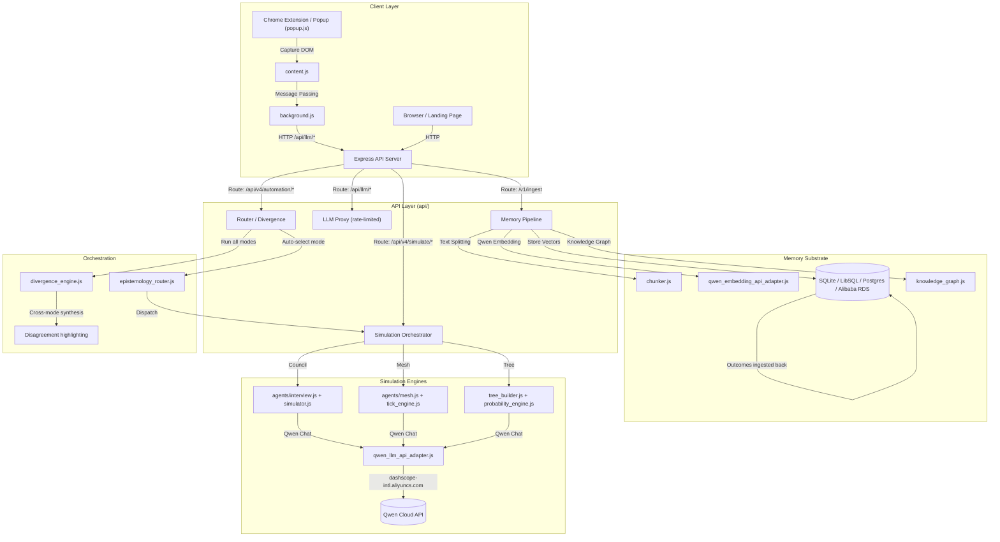
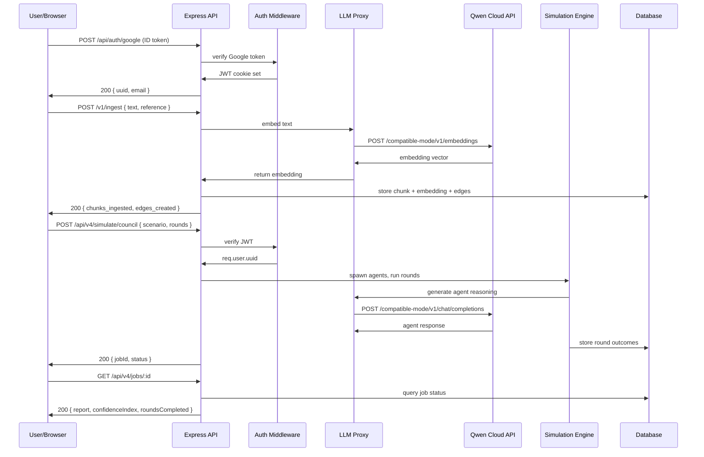

# 🧠 Simulith: Will It Work? Simulate Life Before You Live It.

**Ask any question. Get a simulation of how people, markets, and reality will react.**

**Powered by Qwen Cloud — Built for the Global AI Hackathon Series**

---

## 🚀 TL;DR

Simulith is a multi-agent decision simulator for everyday humans and high-stakes teams alike. Should you quit your job to start that business? Will your company's new policy trigger a PR crisis? Is that crypto token a scam? Paste in a scenario, and Simulith spawns autonomous AI agents who deliberate, factionalize, and explore consequences so you see the future *before* you commit.

Three simulation modes—**Council** (expert panel debates), **Mesh** (social media belief dynamics), and **Tree** (causal consequence explorer)—each reveal different failure modes. An **Orchestrator** auto-selects the best mode or runs all three, highlighting where they disagree (because disagreement *is* the signal). Every simulation feeds into a persistent **memory substrate** (chunking → Qwen embedding → knowledge graph) that makes past outcomes searchable context for future questions.

**Built entirely on Qwen Cloud APIs (`qwen3.7-plus`, `qwen-embedding`), deployed on Alibaba Cloud SAS.**

**Live at**: [simulith.hazeezadebayo.dev](https://simulith.hazeezadebayo.dev)

---

## 🎯 What Can Simulith Do? Real Questions, Real Simulations.

| You Ask                                                  | Simulith Shows You                                                                                                                                                                                                        |
| -------------------------------------------------------- | ------------------------------------------------------------------------------------------------------------------------------------------------------------------------------------------------------------------------- |
| **"Should I start that YouTube channel?"**         | A**Council** debate between Creator, Skeptic, and Audience personas. A **Mesh** simulation of how your first 3 videos spread across viewer factions. A **Tree** map of the 6-month consequence cascade. |
| **"Is my boss gaslighting me, or am I paranoid?"** | **Council** panel evaluates your evidence and returns a manipulation probability index. **Mesh** shows how office gossip narratives evolve.                                                                   |
| **"Will this new company policy backfire?"**       | **Mesh** mode simulates belief drift across 6 months—how values, trust, and conflict patterns evolve between employee personas through 50 interaction ticks.                                                       |
| **"Is this crypto token a pump-and-dump?"**        | **Tree** traces the consequence DAG: what happens to your portfolio and peace of mind. **Council** simulates a panel of Regulator, Trader, and HODLer personas.                                               |

---

## 🏆 Hackathon Alignment & Judging Criteria

We engineered Simulith to directly address the Hackathon rubric:

### 1. Tracks Entered

* **MemoryAgent:** Persistent memory substrate using `qwen-embedding`. Every simulation outcome is ingested into a Knowledge Graph for cross-session recall. Multi-backend DB supports Alibaba ApsaraDB RDS.
* **Agent Society:** Three multi-agent architectures where autonomous agents deliberate (Council), factionalize and drift (Mesh), and map causal outcomes (Tree).
* **Autopilot Agent:** The Router auto-selects the simulation mode from user intent, while the Divergence engine runs all three autonomously, creating an end-to-end pipeline with zero manual routing.

### 2. Judging Criteria Addressed

* **Innovation & AI Creativity (30%):** We treat uncertainty as a feature, not a bug. By running three independent simulation engines and measuring their *divergence*, Simulith provides epistemic certainty that a single LLM wrapper cannot.
* **Technical Depth (30%):** Deep, mathematically rigorous agent dynamics. Tree mode uses MCTS-inspired state-space search with deterministic physics; Mesh mode uses logistic defection probabilities and threshold-based phase transitions. 100% powered by Qwen Cloud endpoints.
* **Problem Value & Impact (25%):** Solves the universal pain point of decision-paralysis. Designed for scale with multi-backend storage (SQLite → Postgres → Alibaba RDS) and Dockerized deployment.
* **Presentation (15%):** Comprehensive Mermaid diagrams, transparent mathematical documentation, and a polished 1-3 minute video demo.

### 3. Submission Checklist

* ✅ **Public GitHub Repo:** Open-source (MIT).
* ✅ **Architecture Diagram:** Detailed below.
* ✅ **Written Summary:** This document.
* ✅ **Proof of Deployment:** Deployed on Alibaba Cloud SAS (Singapore) via Cloudflare Tunnel. The $40 hackathon coupon funded 6 months of hosting.
* ✅ **Video Demo:** Submitted.

---

## 🧮 The Math Behind The Magic (Simulation Modes)

We don't rely on black-box LLM vibes. Qwen provides the semantic reasoning, but the aggregation and scoring are fully deterministic, auditable, and mathematically grounded.

### 1. Council Mode — Structured Expert Deliberation

A panel of generated personas debates your scenario. Each persona has a 4-dimensional trait vector: `{riskBias, evidenceDemand, noveltySeek, clarityNeed}`. For each strategic branch $b$, the confidence index is computed as:

$$
C_b = \text{clamp}(\text{confidenceBase} + \text{support} \times 4 - \text{risk} \times 3 + \text{supportCount} \times 6 - \text{pushbackCount} \times 6 - \text{contradictions} \times 2, 5, 95)
$$

### 2. Mesh Mode — Social Belief Dynamics

Up to 30 autonomous agents form factions, react to narrative shocks, and drift in beliefs. Belief updates per observation are calculated via:

$$
\Delta \text{position} = \frac{(\text{authorStance} - \text{currentPos}) \times \text{postWeight} \times \text{effectiveLR}}{\text{resistance}}
$$

Agents defect from a faction when their expected utility shifts, computed via a logistic function ensuring monotonic defection probability:

$$
P(\text{defect}) = \sigma(\Delta U \times \text{temperature})
$$

### 3. Tree Mode — Causal Consequence Exploration

An MCTS-inspired engine maps decisions into a branching DAG of future states. State transitions use hybrid deterministic-stochastic physics, injecting Gaussian noise for volatility:

$$
S_{t+1} = S_t + \Delta_{\text{elastic}}(S_t, O) + \Delta_{\text{sampled}}(\theta \sim \mathcal{N}(0, \sigma^2)) + \Delta_{\text{interaction}}
$$

Probability distributions for sibling child states use a minimax-regret formulation, where $\tau$ controls exploration temperature:

$$
p_i = \frac{\exp(\text{score}_i / \tau)}{\sum \exp(\text{score}_j / \tau)}
$$

---

## 🏗️ Architecture & Flow

### System Architecture



### Request Flow



---

## 🌐 Deployment on Alibaba Cloud

Deployed on **Alibaba Cloud Simple Application Server (SAS)** — Singapore region, 896MB RAM, 1GB swap. The remainder of the hackathon credit funds the Qwen Cloud API calls via `dashscope-intl.aliyuncs.com`.

* **Containerization**: Docker via GHCR (GitHub Container Registry).
* **CI/CD**: GitHub Actions → build image → push to GHCR → SSH into SAS → docker-compose pull & up.
* **Networking**: Cloudflare Tunnel (no open ports besides 80/443 via proxy).
* **Database Scalability**: Designed to swap instantly from local SQLite to **Alibaba Cloud ApsaraDB RDS** for production scaling.

---

## ⚡ Quick Start

### Prerequisites

* Node.js 20+
* Docker & Docker Compose
* Qwen Cloud API key

### Local Development

```bash
# Install dependencies
cd memtrace && npm install

# Set environment variables
export API_KEY="sk-your-qwen-api-key"
export GOOGLE_CLIENT_ID="your-google-client-id" # optional for local
export JWT_SECRET="your-256-bit-secret"

# Start server
npm run dev
```

### Docker Deployment

```bash
docker build -f docker/Dockerfile.prod -t memtrace .

docker run -d \
  --name memtrace \
  -p 3106:3106 \
  -e API_KEY="sk-your-qwen-api-key" \
  -v memtrace_data:/app/data \
  memtrace
```

### Core API Endpoints (Refer to source for full list)

* **LLM Proxy:** ` /api/llm/summarize`, ` /api/llm/embed`, ` /api/llm/generate-answer`
* **Simulations:** ` /api/v4/simulate/council`, ` /api/v4/simulate/mesh`, ` /api/v4/simulate/tree`
* **Memory Ingestion:** ` /v1/ingest`, ` /v1/search`
* **Automation:** ` /api/v4/automation/router`, ` /api/v4/automation/divergence`

---

**License**: MIT
**Repository**: [github.com/hazeezadebayo/memtrace-simulith](https://github.com/hazeezadebayo/memtrace-simulith)

---

## Powered By Qwen Cloud + Alibaba

Every LLM call — agent reasoning, summarization, embedding, tag generation, belief drift computation, utility scoring — runs through **Qwen Cloud APIs** (`qwen3.7-plus`, `qwen-embedding`). The $40 Alibaba Cloud coupon funded 6 months of Docker SAS (Singapore region, 896MB RAM, 1GB swap) with remaining balance used for Qwen Cloud API calls via `dashscope-intl.aliyuncs.com`.

The integration is deep:

- **`qwen_llm_api_adapter.js`**: Dedicated Qwen chat completion with retry logic, token tracking, and fallback chain (Qwen → OpenAI → Gemini)
- **`qwen_embedding_api_adapter.js`**: Qwen Embedding API for all vector generation
- **Server-side proxy**: API keys never leave the server — the browser extension communicates through authenticated, rate-limited `/api/llm/*` endpoints
- **Rate limiting at 3 tiers**: Token bucket per-user + sliding window per-IP (10 req/min) + global 500 req/min — costing controlled independently at each level

---

---

## Hackathon Fit

### Tracks Entered

| Track                     | Coverage                                                                                                                                                                                                                                              |
| ------------------------- | ----------------------------------------------------------------------------------------------------------------------------------------------------------------------------------------------------------------------------------------------------- |
| **MemoryAgent**     | Persistent, structured memory substrate: chunking → embedding (Qwen) → knowledge graph → cross-session recall. Every simulation outcome is ingested back for future queries. Multi-backend DB including Alibaba ApsaraDB RDS.                      |
| **Agent Society**   | Three multi-agent architectures (Council, Mesh, Tree) with autonomous agents that deliberate, factionalize, compete, and drift. Router/Divergence orchestrator coordinates across modes. Mathematical proofs for belief dynamics and social exchange. |
| **Autopilot Agent** | Router auto-selects simulation mode from user intent. Divergence runs all three autonomously. End-to-end pipeline from ingestion to report with zero manual routing.                                                                                  |

### Submission Checklist

| Requirement                                       | Status                                                                                               |
| ------------------------------------------------- | ---------------------------------------------------------------------------------------------------- |
| Public GitHub repository with open-source license | ✅ MIT License                                                                                       |
| Architecture diagram (Mermaid flowchart)          | ✅ See above                                                                                         |
| Written summary of features & functionality       | ✅ This document                                                                                     |
| Proof of Alibaba Cloud Deployment                 | ✅ Deployed on Alibaba SAS (Singapore), Cloudflare Tunnel, $40 coupon funded 6mo hosting + API calls |
| 1–3 minute demo video                            | ✅ Submitted                                                                                         |
| Open-source frameworks OK; no direct repo cloning | ✅ Built from scratch                                                                                |

---

## Quick Start

### Prerequisites

- Node.js 20+
- Docker & Docker Compose (for production deployment)
- Qwen Cloud API key (sign up at [qwencloud.com](https://qwencloud.com))

### Local Development

```bash
# Install dependencies
cd memtrace && npm install

# Set environment variables
export API_KEY="sk-your-qwen-api-key"
export GOOGLE_CLIENT_ID="your-google-client-id"  # optional for local dev
export JWT_SECRET="your-256-bit-secret"           # optional, auto-generated

# Build popup bundle (optional, for Chrome extension)
npm run build:popup

# Start server
npm run dev
```

Server boots at `http://localhost:3106`.

### Docker Deployment

```bash
# Build production image
docker build -f docker/Dockerfile.prod -t memtrace .

# Run
docker run -d \
  --name memtrace \
  -p 3106:3106 \
  -e API_KEY="sk-your-qwen-api-key" \
  -e GOOGLE_CLIENT_ID="your-google-client-id" \
  -v memtrace_data:/app/data \
  memtrace
```

---

## License

MIT — see [LICENSE](memtrace/LICENSE)

## Repository

[github.com/hazeezadebayo/memtrace-simulith](https://github.com/hazeezadebayo/memtrace-simulith)
