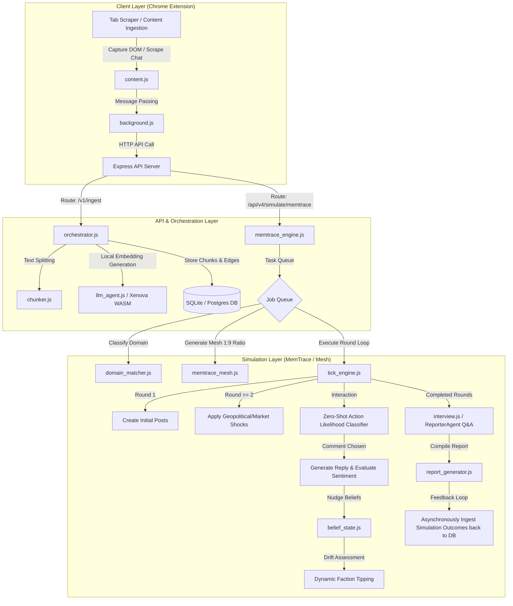
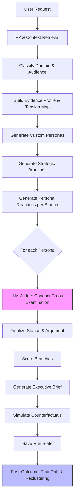
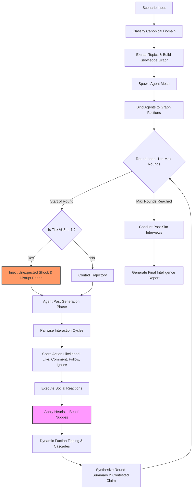
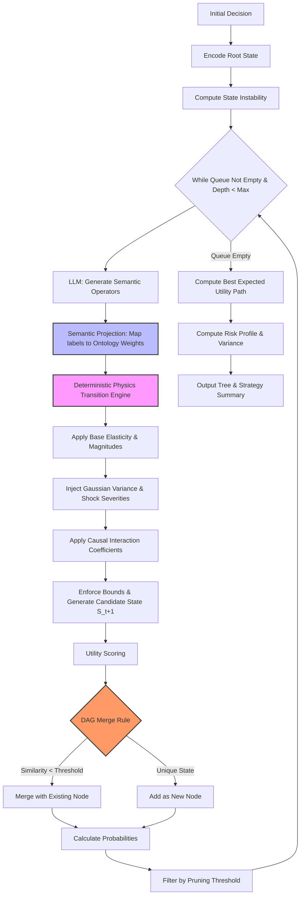

# 🛸 MemTrace & MemTrace Simulation Platform

*Universal Mesh Intelligence Engine & Scenario Decision Simulator.*

---

## 🏆 Qwen Hackathon: Judges Quickstart (Agent Society Track)

Welcome, Judges! MemTrace is a **Universal Mesh Intelligence Engine** perfectly aligned with the **Agent Society** track. It simulates up to 30 autonomous agents that form factions, react to geopolitical/market shocks, and drift in beliefs across a simulated social network.

**How to test quickly:**
1. **Login**: We use Google OAuth to protect API limits, but we have granted **500 free tokens** per new signup—more than enough to run several Mesh simulations. 
   *(Note: Ensure your `.env` contains `GOOGLE_CLIENT_ID` to enable login locally).*
2. **Run a Scenario**: Choose the **"Policy Impact (Downstream Pressure Analysis)"** scenario from the dashboard.
3. **Observe**: Watch as agents generate backstories, interact pairwise over 3 rounds, and output a mathematical confidence index of the policy's outcome.

---

## 📖 What is MemTrace?

In modern AI interactions, researchers and software engineers face a repetitive bottleneck: **context loss across sessions**. Debugging complex microservice architectures or stress-testing economic policies in typical chat interfaces often leads to model fatigue, context truncation, or starting a new thread that requires re-explaining the entire scenario.

**MemTrace** is a privacy-first, local-first context retrieval and serialization framework. It captures, segments, and stores unstructured browser-based chat histories and web pages into a local **Knowledge Graph**. By computing cosine similarity on text embeddings locally (using ONNX models loaded via `@xenova/transformers` run on CPU/WASM), MemTrace links related segments and serves prompt-ready context back to the user or downstream systems.

To leverage this persistent memory substrate, MemTrace runs a multi-agent simulation suite called **MemTrace & Council**:
- **Council Mode (V4–V7)**: Evaluates complex strategic options (Aggressive, Defensive, Lateral) by spawning customized stakeholder personas who debate the branches. Outcome probabilities and confidence ratings are calculated using a deterministic mathematical scoring model.
- **Mesh / MemTrace Mode (V4)**: Automatically classifies scenario domains, constructs faction nodes, and runs a **compressed social simulation** of up to 30 agents. These agents publish posts, react, form connections, drift, and defect between factions across simulated social networks (Twitter, Reddit, HackerNews, Discord, Facebook). Final outputs are ingested back into the vector database, enabling a continuous memory-driven learning loop.

---

## 🛠️ Project Directory Map

```
memtrace/
├── api/                             # Backend Express server endpoints
│   ├── auth_server.js               # Authentication routes and middleware
│   ├── core_memory_server.js        # Core Orchestrator/LLM endpoints (/v1/ingest, /v1/chat)
│   ├── council_server.js            # Council simulation endpoints
│   ├── db_users.js                  # User profile and token tracking
│   ├── memtrace_mode_server.js      # MemTrace simulation mode endpoints
│   ├── memtrace_server.js           # Main Express entry point
│   ├── mesh_server.js               # Mesh intelligence endpoints
│   ├── simulith_server.js           # Shared state, telemetry, and JobQueues
│   ├── telemetry_server.js          # Admin, Profile, and billing stats endpoints
│   └── tree_server.js               # Tree simulation endpoints
├── data/                            # SQLite and LibSQL local database stores
├── docker/                          # Docker configuration and execution templates
├── extension/                       # Chrome WebExtension files
│   ├── background.js                # Extension worker capturing active tabs
│   ├── content.js                   # Client DOM scraper overlay script
│   ├── manifest.json                # WebExtension Manifest v3 configurations
│   ├── popup.html / popup.js        # Extension popup interface
│   ├── core/                        # Context chunking and vector processing
│   │   ├── chunker.js               # Sentence-boundary text chunker
│   │   ├── helper.js                # Vector and tag indexing utilities
│   │   ├── llm_agent.js             # LLM routing and Xenova embedding manager
│   │   ├── memory.js                # SQLite transactions manager
│   │   ├── orchestrator.js          # Core context ingestion coordinator
│   │   ├── rate-limit.js            # Express API rate limiting
│   │   └── utils.js                 # Low-level token helper modules
│   ├── db/                          # Database connection adapters
│   │   ├── abstraction.js           # Generic DB interface template
│   │   ├── memory-factory.js        # Database connection controller
│   │   ├── postgres-adapter.js      # Remote Postgres connection pooling
│   │   ├── remote-adapter.js        # Web-based API syncing adapter
│   │   └── sqlite-adapter.js        # WASM-based SQLite driver for extension
│   ├── env/                         # Configuration properties
│   │   ├── config.example.js        # Environment config reference
│   │   └── config.js                # Environment config loader
│   ├── llm/                         # LLM interfaces
│   │   ├── agent.js                 # High-level local LLM wrapper
│   │   ├── embedding.js             # Embedding API caller
│   │   └── offline_llm.js           # Local offline token classifier
│   └── utils/                       # ONNX model weights and WASM runtimes
│       ├── Xenova/                  # Local ONNX model weights
│       ├── ort-wasm-simd.wasm       # WASM Simd runtime
│       ├── ort-wasm.wasm            # WASM fallback runtime
│       └── transformers.min.js      # Xenova transformers minified build
├── md/                              # System markdown logs and outputs
├── models/                          # Storage for offline local GGUF models
├── simulith/                        # MemTrace & Council simulation engine
│   ├── agent_memory.js              # SQLite engine storing simulation states
│   ├── ai.js                        # Unified OpenAI/OpenRouter interface
│   ├── belief_state.js              # Belief shifts and dynamic faction tipping
│   ├── crawler.js                   # Scraper utilizing headless Playwright
│   ├── domain_matcher.js            # Cosine-similarity domain classifier
│   ├── evidence.js                  # Risk and support fact extractor
│   ├── extra.js                     # Formatting and time execution helpers
│   ├── generative.js                # LLM helper spawning personas
│   ├── graph_ontology.js            # Faction and domain node dictionary
│   ├── interview.js                 # ReporterAgent qualitative Q&A engine
│   ├── knowledge_graph.js           # Ontology parser modeling scenario graphs
│   ├── manifest.js                  # Preloaded domain pools and archetypes
│   ├── memtrace_engine.js           # Core MemTrace round tick coordinator
│   ├── memtrace_mesh.js            # Mesh generator enforcing 1:9 ratio
│   ├── personas.js                  # Spawner generating decision personas
│   ├── council_utils.js               # State loader, cacher, and learning feedback
│   ├── queue.js                     # Job queue with cancel and retries
│   ├── recluster.js                 # Persona re-centering and drift tracker
│   ├── report_generator.js          # Qualitative PDF/Markdown compiler
│   ├── scoring.js                   # Mathematical confidence scoring models
│   ├── shocks.js                    # Database of geopolitical/market shocks
│   ├── simulator.js                 # Council and Mesh coordinate runner
│   ├── mesh.js                     # System prompts and platform mappings
│   ├── tick_engine.js               # Zero-shot action likelihood and stance scoring
│   └── visualize.js                 # Simulation flow logger
├── test/                            # Quality assurance test suite
│   ├── graph_depth.test.js          # Tests semantic graph retrieval expansion
│   ├── orchestration_suite.js       # End-to-end API and security validator
│   ├── race_condition.test.js       # Validates concurrent database updates
│   ├── run_tests_v2.sh              # Main shell execution runner script
│   └── mesh_ratio.test.js          # Asserts strict 1:9 archetype population ratio
├── package.json                     # Node.js project manifest and script declarations
├── project_report.md                # Comprehensive architectural and product report
└── output_log.md                    # Execution evidence log
```

---

## 📋 Comprehensive Module Breakdown

| Module / File Path | Callers / Dependencies | Primary Responsibility (TL;DR) |
| :--- | :--- | :--- |
| **`api/memtrace_server.js`**| Entry point for backend | Instantiates Express server, configures CORS, rates, static folders, and binds routes. |
| **`api/auth_server.js`**    | `memtrace_server.js` | Enforces CORS origins and routes signup, logins, and session management. |
| **`api/db_users.js`**       | `auth_server.js`, `council_server.js` | Connects users DB; monitors token balances, tiers, and registration metadata. |
| **`api/simulith_server.js`**| `memtrace_server.js` | Shared architecture containing JobQueue and global simulation state. |
| **`api/telemetry_server.js`**| `memtrace_server.js` | Contains all user-profile, admin billing statistics, and telemetry logic. |
| **`api/memtrace_mode_server.js`**| `memtrace_server.js`| Routes the MemTrace-specific autonomous simulation loops. |
| **`api/core_memory_server.js`**| `memtrace_server.js` | Orchestrator and Memory (RAG) interactions like ingest, search, and chunking. |
| **`api/council_server.js`** | `memtrace_server.js` | Routes Council jobs to the task queue and hosts council simulation endpoints. |
| **`api/mesh_server.js`**    | `memtrace_server.js` | Routes Mesh intelligence jobs to the task queue. |
| **`api/tree_server.js`**    | `memtrace_server.js` | Routes Consequence Tree simulations to the query adapter. |
| **`extension/background.js`**| Chrome Extension worker | Intercepts browser tab transitions and coordinates page capture processes. |
| **`extension/content.js`** | Active browser pages | Scrapes unstructured DOM text and injects overlay components. |
| **`extension/popup.js`** | `popup.html` | Client-side controller processing manual ingestions, local settings, and searches. |
| **`extension/core/orchestrator.js`**| `server.js`, `popup.js` | Master memory flow; routes text to chunker, local WASM embeddings, and SQLite. |
| **`extension/core/chunker.js`**| `orchestrator.js` | Segments raw text using boundary refinement (sentence rules and token limits). |
| **`extension/core/llm_agent.js`**| `orchestrator.js`, `council_router.js` | Wraps API LLM completions, handles safety injection checks, and loads Xenova embeddings. |
| **`extension/core/memory.js`**| `orchestrator.js` | CRUD repository layer writing chunks, tags, vectors, and edges to database. |
| **`extension/db/sqlite-adapter.js`**| `memory-factory.js` | Local WASM-based SQLite driver for browser-side storage. |
| **`extension/db/postgres-adapter.js`**| `memory-factory.js` | Connection pooling client for enterprise PostgreSQL databases. |
| **`extension/llm/offline_llm.js`**| `llm_agent.js` | Node/WASM CPU inference manager for offline classification. |
| **`simulith/src/db/agent_memory.js`**| `memtrace_engine.js`, `council_router.js` | SQLite store writing persona stances, round summaries, and social networks. |
| **`simulith/src/llm/ai.js`** | `memtrace_engine.js`, `simulator.js` | Centralized LLM query adapter routing requests to OpenAI or OpenRouter fallback. |
| **`simulith/src/agents/belief_state.js`**| `tick_engine.js` | Nudges agent belief vectors dynamically and triggers faction tipping migrations. |
| **`simulith/src/utils/crawler.js`** | `council_router.js` | Headless Playwright crawler extracting readable body content from external URLs. |
| **`simulith/src/graph/domain_matcher.js`**| `memtrace_engine.js` | Uses Xenova embeddings to map raw queries to canonical scenario domains. |
| **`simulith/src/engine/evidence.js`**| `simulator.js` | Extracts risks, support arguments, and logical contradictions from source facts. |
| **`simulith/src/agents/generative.js`**| `memtrace_mesh.js` | Group-batches LLM calls to tailor agent backstories under token limit constraints. |
| **`simulith/src/graph/knowledge_graph.js`**| `memtrace_engine.js` | Parses unstructured text into ontology-based node/edge networks. |
| **`simulith/src/data/manifest.js`** | `memtrace_mesh.js`, `mesh.js` | Data registry for domain templates, specific personas, and pseudo-archetypes. |
| **`simulith/src/engine/memtrace_engine.js`**| `simulator.js` | Primary controller running the MemTrace multi-round agent simulation loop. |
| **`simulith/src/agents/memtrace_mesh.js`**| `memtrace_engine.js` | Assembles agent mesh, enforcing the 1:9 pseudo-archetype ratio. |
| **`simulith/src/utils/council_utils.js`**| `simulith_server.js`, `simulator.js` | Coordinates JSON state serialization, real-world outcome logs, and learning loops. |
| **`simulith/src/utils/queue.js`** | `simulith_server.js` | FIFO job queue executing long-running simulations with progress callbacks. |
| **`simulith/src/agents/recluster.js`**| `simulith_server.js` | Evaluates past forecast accuracy to adjust and drift persona baselines. |
| **`simulith/src/engine/report_generator.js`**| `memtrace_engine.js` | Synthesizes round logs and delta metrics into a markdown intelligence report. |
| **`simulith/src/engine/scoring.js`** | `simulator.js` | Mathematical rank calculations for strategic branches (Aggressive, Defensive, Lateral). |
| **`simulith/src/engine/tick_engine.js`**| `memtrace_engine.js` | Drives round updates: zero-shot action checks, stance updates, and edge scoring. |

---

## ⚡ Setup and Installation

### Prerequisites
- **Node.js**: Version `>= 20.0.0`
- **SQLite3 / LibSQL**: Local database files will be initialized automatically in the `data/` directory.

### Quick Start (Local Run)
1. **Clone the Repository** and navigate to the project directory:
   ```bash
   cd /home/azeez/ws/dev_env/py_code/projects/memtrace/memtrace
   ```
2. **Install Dependencies**:
   ```bash
   npm install
   ```
3. **Configure Environment Variables**:
   Copy the example configuration file:
   ```bash
   cp extension/env/config.example.js extension/env/config.js
   ```
   Open `config.js` and add your LLM API keys (e.g. OpenAI or OpenRouter keys). To run locally offline, set:
   ```javascript
   export const CONFIG = {
     provider: "local", // Sets local FastAPI inference server
     modelName: "unsloth/Qwen3-0.6B",
     embeddingModel: "Xenova/all-MiniLM-L6-v2"
   };
   ```
4. **Start the API Server**:
   ```bash
   npm start
   ```
   The Express API server starts on **Port 3005** (configurable in environment).
5. **Start the Visual Simulator UI Dashboard**:
   ```bash
   npm run start:simulith
   ```
   The visual simulator dashboard is exposed on **Port 3000**.

### Running the Test Suite
We maintain unit and integration tests verifying graph structures, concurrency safety, and the Mesh population ratio:
```bash
npm test
```
*This command executes the master test script `test/run_tests_v2.sh` which enforces deterministic mock LLM execution (`MOCK_LLM=true`) and runs Jest tests alongside the E2E API Orchestration suite.*

---

## 🖥️ Local LLM Server Workflow

To run fully offline and ensure total data privacy, MemTrace integrates with a local LLM server running a quantized Qwen3 model.

1. **Jupyter Notebook Setup**:
   Open `/home/azeez/ws/dev_env/py_code/projects/memtrace/local_llm_server.ipynb` in your Jupyter environment.
2. **Execution**:
   Run the notebook cells. The notebook will:
   - Verify CUDA GPU availability.
   - Load `unsloth/Qwen3-0.6B` using `transformers` with BF16 precision (falling back to FP32 CPU execution if GPU is missing).
   - Start a local `FastAPI` instance exposed on `http://127.0.0.1:8000`.
3. **Client Configuration**:
   The `offline_llm.js` adapter inside the Chrome extension redirects text completion payloads directly to the FastAPI server's `/generate` endpoint.

---

## 🌐 API Reference (REST Endpoint Documentation)

Below are the key endpoints of the MemTrace API with sample JSON request and response payloads.

### 1. Ingest Text Context (`POST /v1/ingest`)
Segments and indexes raw captured text into the persistent SQLite Knowledge Graph.
- **Request Headers**: `Authorization: Bearer <JWT_TOKEN>`
- **Request Body**:
```json
{
  "uuid": "user-session-9912",
  "text": "The banking sector is experiencing liquidity shortages because interest rates remain high. Venture capital firms are slowing down investments.",
  "ref": "https://news.ycombinator.com/item?id=3847291"
}
```
- **Response (`200 OK`)**:
```json
{
  "status": "success",
  "chunksIngested": 1,
  "edgesCreated": 2,
  "uuid": "user-session-9912"
}
```

### 2. Semantic Hybrid Search (`POST /v1/search`)
Executes a vector search over stored chunks, automatically expanding context by traversing ontology graph edges.
- **Request Headers**: `Authorization: Bearer <JWT_TOKEN>`
- **Request Body**:
```json
{
  "uuid": "user-session-9912",
  "query": "venture capital slowdown",
  "limit": 3
}
```
- **Response (`200 OK`)**:
```json
{
  "results": [
    {
      "chunkId": "chunk-102",
      "text": "Venture capital firms are slowing down investments, leading to longer fundraising cycles.",
      "score": 0.892,
      "implicitMatches": [
        {
          "chunkId": "chunk-105",
          "text": "Founders are cutting burn rates due to tight VC availability.",
          "relation": "downstream_effect"
        }
      ]
    }
  ]
}
```

### 3. Start Mesh Intelligence Simulation (`POST /api/v4/simulate/mesh`)
Launches a multi-round social agent simulation based on scenario facts.
- **Request Headers**: `Authorization: Bearer <JWT_TOKEN>`
- **Request Body**:
```json
{
  "uuid": "user-session-9912",
  "question": "What is the industry consensus on startup runway metrics for 2026?",
  "facts": [
    "Most seed startups have less than 12 months of cash runway.",
    "VC funds are focusing on capital efficiency over growth."
  ],
  "agentCount": 12,
  "rounds": 3,
  "platforms": ["twitter", "linkedin", "reddit"]
}
```
- **Response (`202 Accepted`)**:
```json
{
  "jobId": "job-mesh-7312",
  "status": "queued",
  "progressUrl": "/api/v4/jobs-mesh/job-mesh-7312"
}
```

### 4. Fetch Mesh Job Status (`GET /api/v4/jobs-mesh/:id`)
Tracks the execution progress of an active simulation job.
- **Request Headers**: `Authorization: Bearer <JWT_TOKEN>`
- **Response (`200 OK`)**:
```json
{
  "id": "job-mesh-7312",
  "status": "processing",
  "progress": 66.6,
  "stage": "Round 2: Processing interactions",
  "tokensUsed": 14200
}
```

### 5. Chat with Stakeholder Agent (`POST /api/v4/mesh/:simId/agent/:agentId/chat`)
Engage in qualitative ReporterAgent chats to cross-examine specific agents post-simulation.
- **Request Headers**: `Authorization: Bearer <JWT_TOKEN>`
- **Request Body**:
```json
{
  "message": "Why did you vote to oppose the proposed runway extensions?"
}
```
- **Response (`200 OK`)**:
```json
{
  "agentId": "HardwareGeek_7",
  "response": "Extending runways via debt only delays the inevitable. We need fundamental hardware unit-economics efficiency, not temporary loans.",
  "beliefDeltas": {
    "capital_efficiency": 0.15,
    "growth_priority": -0.20
  }
}
```

---

## 🚀 Future Upgrades and Web Deployment

To deploy this project to production:
1. **Container Infrastructure**: Build the production image using the standard Docker setup. Deploy Express APIs alongside a GPU-accelerated sidecar running a FastAPI wrapper for vLLM or HuggingFace TGI.
2. **Storage Scaling**: Swap the local SQLite driver configuration inside `memory-factory.js` to Postgres mode, routing transactions to a clustered cloud Postgres database (such as Neon or AWS Aurora).
3. **Billing Integration**: Implement stripe webhooks to dynamically recharge user tokens recorded in `db_users.js` based on actual LLM generation usage.


# 🛸 MemTrace & MemTrace Social Simulation Platform

MemTrace is a local-first, privacy-first context extraction, vector index, and graph serialization system. It allows developers to capture active chat history pages or unstructured briefs, chunk them semantic-sensitively, generate local ONNX vector embeddings, and project them into an inspectable Knowledge Graph.

On top of this memory platform, MemTrace layers a multi-agent simulation framework (**MemTrace & Council**) to simulate narrative evolution, brand reactions, policy impacts, and financial case studies.

---

## 1. File Modules & Tldr Information

| File Path | Description / Responsibility |
| :--- | :--- |
| **`api/memtrace_server.js`** | Boots the primary Express server on port `3005`, mounting core middleware (origin checking, authentication) and exposing `/v1/ingest` and `/v1/search`. |
| **`api/council_server.js`** | Exposes router endpoints for Council simulations, job query/cancellation routing, and ReporterAgent interview interactions. |
| **`api/mesh_server.js`** | Exposes router endpoints for Mesh simulations, including `/api/v4/simulate/mesh`. |
| **`simulith/src/agents/mesh.js`** | Orchestrates Mesh agent creation. Enforces the strict **1:9 ratio** of general pseudo-archetypes to domain-specific personas, utilizing Pop shuffling to prevent duplicate allocations. |
| **`simulith/src/data/manifest.js`** | Serves as the domain and archetype registry. Classifies scenarios into domains (e.g. `TECH`, `FINANCE`) and contains the canonical registry of specialized stakeholder backstories. |
| **`simulith/src/engine/simulator.js`** | Orchestrates the Council simulation framework, evaluating decision branches (Aggressive, Defensive, Lateral) against stakeholder stances. |
| **`simulith/src/engine/memtrace_engine.js`**| Drives Mesh simulation execution. Manages the job queue lifecycle, loads domain profiles, and delegates round-by-round processing. |
| **`simulith/src/engine/tick_engine.js`** | Manages the round loop iteration. Applies geopolitical/market shocks, triggers post-generation, and evaluates zero-shot action likelihoods. |
| **`simulith/src/agents/belief_state.js`** | Computes agent belief vector drifts and stance updates based on reply sentiment and historical trust decay. |
| **`simulith/src/engine/scoring.js`** | Calculates quantitative confidence metrics, faction stance convergence, and alignment indices. |
| **`simulith/src/engine/report_generator.js`**| Compiles the final simulation Markdown report summarizing risks, key actors, round logs, and confidence readouts. |
| **`extension/content.js`** | Chrome Content Script. Scrapes the active tab's chat logs or article text and sends the raw text payload to the extension background script. |
| **`extension/background.js`** | Chrome Background Script. Manages runtime state, communicates with `popup.js`, and relays scraped data to the local Express API server. |
| **`extension/popup.js`** | Chrome Extension Popup. Provides the user interface displaying ingestion progress and simulation controls. |
| **`local_llm_server.ipynb`** | FastAPI server running HuggingFace transformers (`unsloth/Qwen3-0.6B`) locally to perform offline generation. |

---

## 2. High-Level Architectural Flow



---

# Mode Based Architectural Flow

For the three primary simulation architectures in the MemTrace project: **Council Mode**, **Mesh Mode**, and **Tree Mode**.

## 1. Council Mode (Stakeholder Deliberation & Cross-Examination)

Council Mode is designed to evaluate strategic decisions by subjecting them to a panel of dynamically generated, highly opinionated personas.



## 2. Mesh Mode (Social Dynamics & Belief Contagion)

Mesh Mode simulates a complex, multi-agent social network where beliefs evolve stochastically based on interactions, shocks, and knowledge graph constraints.



## 3. Tree Mode (State-Space MCTS & Deterministic Physics)

Tree Mode transforms subjective LLM planning into a mathematical, causal Monte Carlo Tree Search, separating the generative logic from the deterministic physics execution.



---

## 3. Project Overview & Core Mechanics

MemTrace acts as a **persistent context substrate**. It converts temporary chat details into permanently cached embeddings and graph nodes, ensuring historical workspace threads remain queryable across new LLM contexts.

### How Mesh Simulation Works:
1. **Ingestion & Graph Projection**: Scraped context is projected into an ontology graph containing faction nodes.
2. **Dynamic Mesh Allocation**: The system dynamically matched the context topic to a domain (e.g. `TECH`) and generates a population of agents following a strict **1:9 ratio** (90% domain-specific personas, 10% general critical personas like *The Builder* or *The Skeptic*) to avoid echo-chamber behavior.
3. **Stochastic Round Tick**: The engine runs 3 simulation rounds:
   - *Round 1*: Agents write initial posts showing their default faction stances.
   - *Round 2*: External shocks (e.g., policy updates, market spikes) are applied. Agents react.
   - *Round >=3*: Pairwise social interactions (likes, comments, follows) run. Edges and beliefs shift based on zero-shot action probabilities and reply sentiment.
4. **Defection**: Agents whose stances drift too far from their bound faction defect dynamically.
5. **ReporterAgent Interviews**: Users can chat directly with individual agents post-simulation to inspect their rationales.
6. **Grounding**: The final simulation report is ingested back into MemTrace, making the outcome searchable in future sessions.

---

## 4. Usage, Installation & API Reference

### A. Prerequisites & Local LLM Server Setup
1. **Python Dependencies**:
   ```bash
   pip install torch transformers fastapi uvicorn pydantic nest-asyncio accelerate
   ```
2. **Boot the Local Server**:
   Open a terminal and run:
   ```bash
   jupyter nbconvert --to script local_llm_server.ipynb
   python3 local_llm_server.py
   ```
   *The server loads Qwen3-0.6B and listens on `http://127.0.0.1:8000/generate`.*

### B. Core API server Setup
1. **Install Dependencies**:
   ```bash
   npm install
   ```
2. **Start the API Server**:
   ```bash
   npm run dev
   ```
   *The Express server boots on `http://127.0.0.1:3005`.*

3. **Running the Test Suite**:
   ```bash
   ./test/run_tests_v2.sh
   ```

---

### C. API Endpoint Documentation

#### 1. Ingest Text Context
- **Endpoint**: `POST /v1/ingest`
- **Headers**: `Content-Type: application/json`
- **Request Payload**:
```json
{
  "text": "The company has announced a shift towards fully remote work. While developers are excited, operations teams are raising concerns about shipping physical assets.",
  "reference": "https://company.internal/policy/work-location-memo",
  "uuid": "43e24522-9a75-43f0-83f9-48b3ca18cb6f"
}
```
- **Response Payload**:
```json
{
  "status": "success",
  "chunks_ingested": 2,
  "edges_created": 1,
  "reference_id": "43e24522-9a75-43f0-83f9-48b3ca18cb6f"
}
```

#### 2. Search Ingested Context
- **Endpoint**: `POST /v1/search`
- **Request Payload**:
```json
{
  "query": "remote work policy concerns",
  "limit": 5
}
```
- **Response Payload**:
```json
{
  "query": "remote work policy concerns",
  "results": [
    {
      "chunk": "operations teams are raising concerns about shipping physical assets...",
      "score": 0.88,
      "reference": "https://company.internal/policy/work-location-memo"
    }
  ]
}
```

#### 3. Trigger Mesh Simulation
- **Endpoint**: `POST /api/v4/simulate/mesh`
- **Request Payload**:
```json
{
  "scenario": "How will our launch of the decentralized storage protocol affect enterprise compliance teams?",
  "rounds": 3,
  "agentCount": 12,
  "uuid": "bf8c5477-1084-44f0-b00f-35e3a6664138"
}
```
- **Response Payload**:
```json
{
  "status": "enqueued",
  "jobId": "job_1717012345678",
  "message": "Mesh simulation enqueued successfully."
}
```

#### 4. Get Mesh Job Status
- **Endpoint**: `GET /api/v4/jobs-mesh/:id`
- **Response Payload**:
```json
{
  "jobId": "job_1717012345678",
  "status": "completed",
  "progress": 100,
  "result": {
    "report": "# Mesh Simulation Report\n## Dominant Risk: Compliance friction...",
    "roundsCompleted": 3,
    "confidenceIndex": 0.76
  }
}
```

#### 5. Chat with Mesh Agent (ReporterAgent Mode)
- **Endpoint**: `POST /api/v4/mesh/:simId/agent/:agentId/chat`
- **Request Payload**:
```json
{
  "message": "Why did you vote to defect from the Enterprise faction in Round 2?"
}
```
- **Response Payload**:
```json
{
  "agentId": "CyberSecurity_5",
  "response": "The compliance memo introduced excessive friction for security key rotation, making my alignment with the Enterprise baseline indefensible."
}
```

---

## 5. MemTrace Landing Page Copy & Structural Assets

To enable rapid deployment of a landing page frontend, we have structured the complete copywriting assets, playbooks, prompts, and research frameworks directly below:

### A. The Core Scenario Gallery
Use these templates to configure scenario routing on the landing page UI:

1. **Public Opinion (Narrative Escalation Map)**
   - *Description*: Model how institutions, media, influencers, and observers reshape the first narrative around an incident.
   - *Typical Input*: Incident brief + policy memo.
   - *MemTrace Integration*: Parses the incident brief into a graph structure where node weights determine narrative dominance.

2. **Launch Reaction (Top Misunderstanding Risk)**
   - *Description*: Stress-test product messaging before competitors, users, and commentators interpret the launch for you.
   - *Typical Input*: Launch brief + FAQ.
   - *MemTrace Integration*: Measures stance divergence to highlight how external actors are likely to misinterpret specific messaging points.

3. **Policy Impact (Downstream Pressure Analysis)**
   - *Description*: Inspect how different stakeholder groups interpret a draft policy once incentives and compliance pressure collide.
   - *Typical Input*: Policy draft + stakeholder notes.
   - *MemTrace Integration*: Models faction dynamics showing where compliance incentives trigger opposing alliances.

4. **Brand Crisis (Crisis Response Gap)**
   - *Description*: See how a fragile launch or reputational event expands when the public question drifts away from internal intent.
   - *Typical Input*: Risk memo + response plan.
   - *MemTrace Integration*: Simulates three rounds of public escalation to identify vulnerabilities in the response strategy.

5. **Finance Case (Sentiment Divergence Summary)**
   - *Description*: Run a market-facing scenario where management, analysts, and retail narratives react to the same financial signal differently.
   - *Typical Input*: Earnings note + market context.
   - *MemTrace Integration*: Sets up distinct corporate and retail faction nodes with varying access to simulated market news feeds.

6. **Literary Continuation (Character Pressure Graph)**
   - *Description*: Treat a fictional world as a live graph of motives and memory, then test how one new event changes the story.
   - *Typical Input*: Narrative chapter + continuation brief.
   - *MemTrace Integration*: Models narrative continuity by reading character files and mapping changes in relationships as graph edges.

### B. Interactive Simulation Dashboard Components
The interface should expose three visual tabs:
- **Graph View**: Visualizes the scenario ontology as a live node-edge network mapping faction stances and dynamic trust edges.
- **Simulation View**: Displays a real-time feed of multi-agent social interactions (posts, comments, follows) updating round-by-round.
- **Report View**: Provides the compiled Markdown intelligence summary containing deterministic scoring indexes.

### C. Executive readouts & Prompts
- **Dominant Risk Summary**: Compresses predicted trajectories into concise readouts (e.g., *Sustained trust erosion from delayed response*).
- **Key Actors Indicator**: Highlights nodes whose influence scores mutate fastest (e.g., *Narrative drivers outrun formal clarification*).
- **Prompt Recipe Library**:
  - *Public Opinion Forecast*: "Forecast how the uploaded incident evolves across public platforms, who amplifies it first, and what response slows trust erosion over three rounds."
  - *Launch Stress Test*: "Simulate how customers, competitors, and commentators react to this launch brief, and identify the most expensive misunderstanding if left unanswered."
  - *Policy Reaction*: "Simulate how institutions, affected groups, and public commentators interpret this policy draft, and identify the largest downstream pressure."
  - *Narrative Continuation*: "Simulate how this narrative world evolves after the new event, which characters gain influence first, and what tension changes the final outcome."

### D. Trust & Research Framework
- **What MemTrace Simulates**: Actor incentives, motive conflict, platform-native narrative spread, and sequential round effects.
- **What Remains Human**: Choosing the scenario boundary, inspecting graph completeness (missing pressure), and making high-stakes operating calls.
- **Epistemic Approach**: Forecasts are treated as inspectable hypotheses and reviewable evidence, not absolute certainty.

---

## 6. Upgrades & Deployment Publishing Guide

To publish MemTrace as a public, production-grade web application:

```
                  +--------------------------------+
                  |    Nginx Reverse Proxy / SSL   |
                  +---------------+----------------+
                                  |
            +---------------------+---------------------+
            | (Port 80/443)                             | (Port 8000)
            v                                           v
+-----------------------+                    +---------------------+
| Express API Server    |                    | Local LLM Sidecar   |
| (Node.js Cluster)     |                    | (FastAPI / CUDA)    |
+-----------+-----------+                    +----------+----------+
            |                                           |
            +---------------------+---------------------+
                                  | (Internal Network)
                                  v
                    +-----------------------------+
                    | Postgres DB (Multi-Tenant)  |
                    +-----------------------------+
```

### Next Steps for Production:
1. **Database Migration**: Swap SQLite for a PostgreSQL instance. Update standard node configurations to pool queries concurrently.
2. **Reverse Proxying**: Use Nginx to expose `/api/v4/simulate/mesh` externally, routing HTTPS queries with secure headers.
3. **Frontend Publishing**: Build the user-facing webapp dashboard with a modern component library, binding real-time state hooks to the Express API. Expose the **Scenario Gallery** templates using pre-loaded JSON contexts.

---

## 7. Qwen Global AI Hackathon Configuration

This project is explicitly positioned for the **Qwen Global AI Hackathon (Track 3: Agent Society)**. 

*Hackathon Thesis:* **Most AI systems collapse uncertainty into one answer. This system preserves and operationalizes disagreement.** 

MemTrace runs multiple reasoning worlds (social, adversarial, causal) and compares them to expose decision uncertainty. It is a decision intelligence research tool and epistemic modeling system that utilizes the advanced reasoning capabilities of **Qwen-Turbo**.

### How to run the Qwen-Powered Architecture:

This repository features highly isolated adapters for Qwen infrastructure, ensuring production stability while fully satisfying the hackathon's Alibaba Cloud deployment requirements.

1. **Configuration**: Open `extension/env/config.js` and set the following parameters:
   ```javascript
   export const CONFIG = {
     db_type: 'alibaba',       // Triggers the Alibaba Cloud RDS Adapter
     database_url: '...',      // Your Alibaba Cloud ApsaraDB (PostgreSQL) connection string
     llm_provider: 'qwen',     // Triggers the DashScope qwen-turbo adapter
     emb_provider: 'qwen',     // Triggers the DashScope text-embedding-v4 adapter
     dashscopeApiKey: '...',   // Your provided sk-ws-... DashScope API Key
   };
   ```

2. **Proof of Alibaba Cloud Deployment**: 
   The storage layer uses an isolated adapter `extension/db/alibaba_cloud_rds_adapter.js`. This connects directly to an **Alibaba Cloud ApsaraDB for RDS (PostgreSQL)** instance. This satisfies the hackathon requirement to demonstrate backend functionality running on Alibaba Cloud services.

3. **Isolated Adapters**: 
   To maintain structural integrity, all Qwen API integrations are separated into descriptive files:
   - `extension/llm/qwen_llm_api_adapter.js`: Manages `qwen-turbo` generation with `enable_thinking: true`.
   - `extension/llm/qwen_embedding_api_adapter.js`: Manages `text-embedding-v4` for vector generation.
   - `extension/db/alibaba_cloud_rds_adapter.js`: Manages vector/graph storage on Alibaba Cloud RDS.

### 4. Testing the Qwen Configuration (For Novices)

If you want to quickly test that your Qwen API key works for the LLM and Embedding models (without needing to set up an Alibaba Cloud RDS database), we have provided a lightweight validation script.

1. **Open your terminal**
2. **Navigate (cd) into the test directory**:
   ```bash
   cd /home/azeez/ws/dev_env/py_code/projects/memtrace/memtrace/test
   ```
3. **Run the validation script using Node.js**:
   ```bash
   node test_alibaba_qwen.js
   ```

You should see an output indicating success for both the Qwen LLM ("Pong") and the Qwen Embedder (Array length: 1024). 
*(Note: The database test section is safely skipped by default to avoid billing charges if you do not have a free RDS instance.)*
