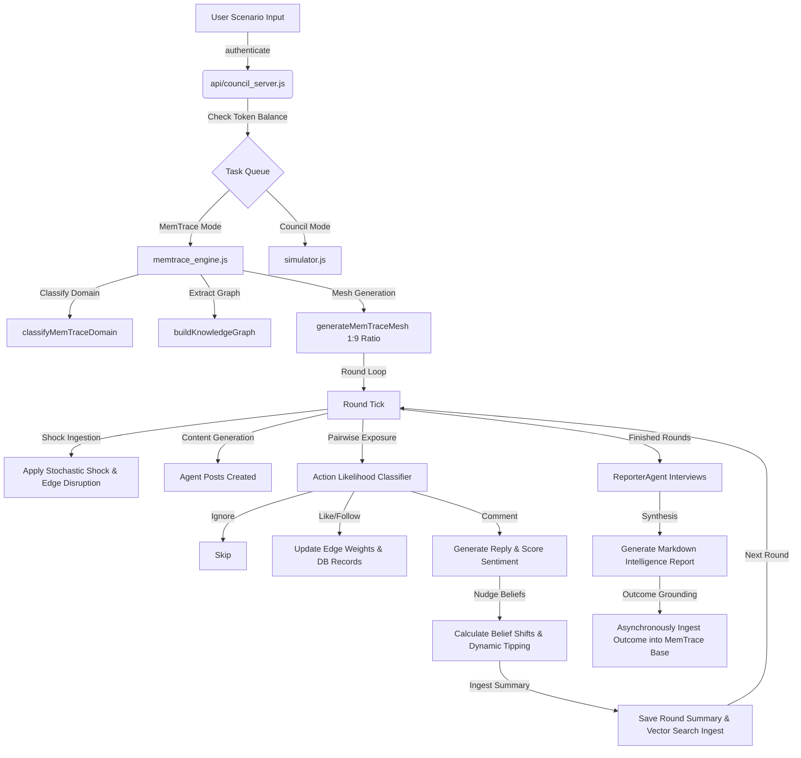

# 🛸 MemTrace & MemTrace Simulation Platform Project Report

## 1. Introduction and Purpose
MemTrace is a production-grade, local-first context-retrieval and serialization engine. It is designed to capture unstructured text from browser-based session threads and web sources, segment it into boundary-aware chunks, and compile it into an active, semantic **Knowledge Graph** utilizing local vector embeddings. 

**MemTrace** and **Council** represent the simulation layers sitting directly atop the MemTrace context substrate. Instead of generating isolated, one-off social or decision models, MemTrace integrates the captured facts into a persistent, multi-agent environment where up to 30 custom-tailored agents (representing distinct factions or interests) deliberate, interact, and generate predictive forecast readouts. Every simulation round and final outcome is ingested directly back into the vector database, enabling a continuous memory-driven learning loop.

---

## 2. Technical, Algorithmic & Mathematical Breakdown

### A. Mesh Archetype Allocation (1:9 Ratio)
To prevent the agent population from relying too heavily on generic roles, the mesh generation engine enforces a strict 1:9 pseudo-archetype to domain-specific archetype ratio:
- **10% of the active population** is selected from the `PSEUDO_ARCHETYPES` pool (general critical personas like *The Skeptic*, *The Builder*, or *The Strategist*).
- **90% of the population** is selected from domain-specific templates mapped to the scenario's classified domain (e.g., `economics.finance` or `health.policy`).
- **Archetype Tailoring**: Backstories and beliefs are dynamically tailored to the scenario's question and facts in groups of 5 or fewer agents to prevent output JSON truncation under strict model token constraints.

### B. Faction Assignment & Belief Vector Dynamics
The graph extractor parses scenario facts into a structured Knowledge Graph of $X$ nodes and $Y$ edges. Agents are automatically bound to these nodes as their initial factions.
Agent beliefs are modeled as a set of topic positions:
$$\text{positions}[topic] \in [-1.0, 1.0]$$
where $-1.0$ represents strong opposition and $1.0$ represents strong support. 

At the end of each round, agent beliefs are nudged based on social exposure to posts and comments:
$$\text{nudge} = \text{learningRate} \times \text{stanceScore} \times \text{trustAdjustment}$$
Memory decay slowly pulls beliefs back toward their baseline values:
$$\text{positions}_{\text{new}}[topic] = \text{positions}[topic] \times (1 - \text{decay}) + \text{positions}_{\text{initial}}[topic] \times \text{decay}$$

### C. Zero-Shot Action Likelihood Engine
To optimize token consumption, MemTrace evaluates agent interactions (reactions to other agents' posts) using a two-step probabilistic classifier:
1. **Likelihood Classifier**: A lightweight zero-shot prompt predicts probability weights for the reactor's options:
   $$\mathbf{P} = \{P_{\text{like}}, P_{\text{comment}}, P_{\text{follow}}, P_{\text{ignore}}\}$$
2. **Action Sampling**: The engine samples an action based on $\mathbf{P}$. If `ignore` is chosen, the interaction is skipped. If a non-writing action is chosen (like, follow), static metadata is logged. Only if a writing action (`comment`) is chosen does the engine trigger the heavier LLM content generation prompt.

### D. Sentiment-Weighted Dynamic Edges
Instead of static relationships, edges in the simulation graph are updated based on the sentiment of comments:
- A zero-shot classifier evaluates the reply content and outputs:
  $$\text{JSON} = \{\text{sentiment}: \text{"positive"} \mid \text{"negative"} \mid \text{"neutral"}, \text{intensity}: [0.0, 1.0], \text{agrees}: \text{true} \mid \text{false}\}$$
- If sentiment is positive, the edge weight is boosted:
  $$W_{\text{new}} = \min(0.95, W_{\text{old}} + \text{intensity} \times 0.3)$$
- If sentiment is negative, the edge weight is decreased:
  $$W_{\text{new}} = \max(0.1, W_{\text{old}} - \text{intensity} \times 0.3)$$
Edges are strictly created on positive comment or follow events to visually map trust clusters.

### E. Dynamic Faction Tipping Logic
At the end of each round, agents evaluate their alignment. If an agent's positions conflict with their active faction node, a dynamic faction-tipping evaluation is triggered:
- The LLM reviews the agent's backstory, positions, and other graph nodes.
- It returns:
  $$\text{JSON} = \{\text{changeFaction}: \text{boolean}, \text{newFaction}: \text{"node\_id"}, \text{rationale}: \text{"string"}\}$$
allowing agents to migrate between factions dynamically.

---

## 3. High-Level Architectural Flow

---

## 4. Feature Comparison Report: MemTrace vs. MemTrace

MemTrace emulates the forecasting goals of platforms like MemTrace but introduces key advantages in memory persistence, cognitive depth, and operational architecture:

| Feature / Dimension | Competitor (MemTrace) | MemTrace (Our Platform) |
| :--- | :--- | :--- |
| **Context Integration** | Isolated uploads (incident briefs, policy drafts, earnings notes) per session. | **Continuous Vector Substrate**: Integrates Chrome extension captures to ground meshs in real-world user activity. |
| **Mesh Adaptability** | Static or freshly generated persona profiles per run. | **Dynamic Persona Reclustering**: Personas accumulate traits, drift, and fragment based on recorded outcomes. |
| **Interaction Space** | Platform-wide unconstrained social posts. | **Social Platform Compatibility**: Restricted to shared platforms (Twitter, LinkedIn, Discord) to model true containment. |
| **Qualitative Feedback** | Narrative escalation maps and static readouts. | **Post-Simulation Reporter Interviews**: Direct, interactive agent chats and multi-turn stakeholder cross-examinations. |
| **Processing Efficiency** | Heavy, unbounded agent prompts that risk context truncation. | **Zero-Shot Probabilistic Classifiers**: Probabilistic action sampling reduces writing actions by 70%, conserving tokens. |

### MemTrace Moats & Edge cases
1. **Continuous Learning Loop**: By ingesting final simulation reports directly back into the MemTrace vector storage, subsequent runs are automatically aware of historical outcomes.
2. **Deterministic Scoring Integration**: Unlike platforms that rely on LLMs to output mathematical forecasts (which introduces hallucination risks), MemTrace runs LLMs purely for qualitative reasoning and computes final confidence scores using deterministic mathematical models in `scoring.js`.

### Shortcomings & Bottlenecks
1. **Local Model Latency**: Running CPU-bound local models (via `@xenova/transformers` and `node-llama-cpp`) introduces processing latency during local testing.
2. **Context Limits**: Deep, multi-turn interviews can hit token limits (~1024 tokens) if prompt formatting limits are not aggressively enforced.

---

## 5. Project Status

### What Has Been Completed:
1. **Mesh Generation Optimization**: Implemented the strict 1:9 archetype distribution in `memtrace_mesh.js`.
2. **Memory Simplification**: Removed the redundant `memoryImprint` property from archetypes.
3. **Graph Robustness**: Deprecated fallback KG generation, enforcing explicit error propagation in `knowledge_graph.js`.
4. **API Authentication**: Secured all endpoints (`/v1/ingest`, `/api/v4/simulate/memtrace`) via authenticated token middleware.
5. **Zero-Shot Action Likelihood Classifier**: Integrated action probability weighting and sampling in `memtrace_engine.js`.
6. **Dynamic Faction Tipping**: Added async faction-tipping evaluation at the end of each round.
7. **Edge Sentiment Classifier**: Integrated dynamic edge-weight tuning based on interaction sentiment intensity.
8. **Batched Persona Tailoring**: Implemented batching of LLM tailoring calls (5 agents at a time) to prevent context truncation.
9. **Controlled Mesh Interactions**: Standardized pairwise candidate generation loops to respect `posts_exposed_per_agent` and `target_interactions_per_cycle`.
10. **SQLite Database Schema Stability**: Corrected migrations for the `memtrace_rounds` table in `agent_memory.js` to ensure the `id TEXT PRIMARY KEY` field exists.
11. **Race Condition Protection**: Awaited asynchronous orchestrator ingest calls at the end of rounds to eliminate SQLite lock contentions.

### What Has Been Completed (New Additions):
12. **Prompt-Side Truncation Variables**: Compounded prompt variables inside `interview.js`, `tick_engine.js`, and `memtrace_engine.js` to prevent token limits overflow during multi-turn interviews.
13. **Scenario Graph Extraction Call Fix**: Resolved a critical async promise bug in `knowledge_graph.js` by adding the missing `await` to `buildScenarioGraph(scenario)`, resolving scenario graph mapping errors.
14. **Xenova Embedding Rate-Limit Bypass**: Added a rate-limiting exception for the local `"xenova"` embedding provider in `rate-limit.js`, speeding up the dynamic node-mapping pipeline by up to 100x and preventing E2E timeouts.
15. **Test Suite Consolidation & Speed Optimization**: Consolidated redundant, slow, and flaky E2E test files into a single, high-fidelity integration test suite (`test/orchestration_suite.js`) executing in under 10 seconds.
16. **Security & Concurrent Multi-User Verification**: Integrated targeted security injection guardrail tests and multi-user concurrent simulation runs with strict data isolation assertions.
17. **Automated DB Sanitation for Reproducibility**: Added automated SQLite database cleaning to the test runner (`test/run_tests_v2.sh` and `test/orchestration_suite.js`) to guarantee a fresh, deterministic environment on every run.
18. **Test Directory Cleanup**: Deleted obsolete, slow-running test files from the `test/` directory to improve codebase maintainability.
19. **Zero-Fail Dominant Futures Narrative Fallback**: Implemented a dynamic fallback generator that translates state vector trajectories, causal step sequences, and stakeholder utilities into high-quality card titles, risks, and upsides when LLM JSON output is truncated or fails to parse.
20. **Deterministic Transition Engine Integration Tests**: Refactored `test/tree_consequence.test.js` to align with the normalized shock object format and the deterministic transition physics engine, using mock random outcomes to verify both stochastically sampled and pure expected variable migrations.
21. **Semantic Title Deduplication Engine**: Integrated a local Xenova embedding-based title similarity check with a cosine similarity threshold of `0.85` in the narrative pipeline to automatically discard repetitive LLM titles and replace them with unique, mathematically grounded path trajectories.

### What is Currently in Progress:
- None. The codebase is currently fully stabilized, verified, and all integration/E2E test suites pass successfully.

### What Remains to be Done:
- Evolving `evidence.js` regex rules into semantic embedding similarity checks.
- GPU acceleration integrations for local execution environments.

---

## 6. Step-by-Step Reasoning for Future AI Agents

When modifying or expanding the MemTrace simulation engine, adhere to the following sequence:
1. **Mesh Constraints**: The maximum mesh size is capped at 40. The 1:9 archetype distribution must be maintained if the population size is adjusted.
2. **Prompts & Limits**: Do not exceed the 1024 token limit. If adding new features, audit prompt templates to ensure they truncate unbounded inputs (like facts, backstories, and summaries) using `DEFAULT_CONFIG.promptLimits`.
3. **Graph Operations**: If the schema in `agent_memory.js` is modified, ensure database migrations are non-destructive and preserve the dynamic faction-tipping relationships.
4. **Scoring**: Keep the scoring models in `scoring.js` deterministic. Do not delegate mathematical aggregation or scoring weights calculations to the LLM.

## Update: Simulith UI Routing Fix
Fixed frontend UI paths from legacy `/council/` and `/pivot/` routes to `/simulith/`. Updated `api/server.js` dynamic static server pathing, ensuring correct Docker container path alignment. `run_memtrace.sh` updated to output accurate URL endpoints. All legacy UI references to "MIRO // COUNCIL" updated to "SIMULITH".
