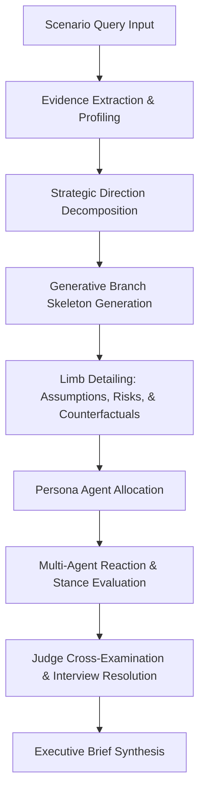

# Project Report: Memtrace Simulith Consequence Engine

## 1. Introduction and Purpose
Memtrace Simulith is a predictive agentic simulation engine built to evaluate strategic scenarios and decisions. It structures queries into decision trees, injects stochastic perturbations/shocks, evaluates stakeholder utility vectors, and runs competitive debates or cross-examinations between simulated persona agents to expose blind spots and hidden assumptions.

---

## 2. Architectural Flow

The execution pathway for a scenario simulation proceeds as follows:



---

## 3. Technical & Algorithmic Details

### A. The LLM Connector System (`callLLM`)
To interact with models, all components consume a standardized signature:
```javascript
export async function callLLM(prompt, temperature = undefined, provider = null, apiKey = null, model = null)
```
The implementation internally resolves default credentials and model configurations from `DEFAULT_CONFIG` when optional parameters are omitted, `null`, or `undefined`. This allows simple, clean invocations like `callLLM(prompt, temperature)` while preserving the capability to override settings.

### B. Consequence Engine Instability-Driven State-Space Search
The consequence tree mode has been migrated to a stochastic dynamical system:
- **Instability Score ($I(S)$):** Determined by the divergence of state variables from equilibrium values, scaled by the variables' outbound coupling coefficients in the interaction network:
  $$I(S) = \text{clamp}\left( \frac{1}{|V|} \sum_{v \in V} \text{divergence}(v) \cdot (1 + \sum \text{outbound\_coupling}(v)), 0.0, 1.0 \right)$$
- **Entropy-Driven Branching:** Local branching factor is calculated dynamically as a function of the parent node's instability:
  $$B_{\text{local}} = \text{clamp}\left( \text{round}(1 + I(S) \cdot (B_{\text{max}} - 1) \cdot 1.5), 1, B_{\text{max}} \right)$$
- **Relative Regret-Based Selection:** Replaces absolute scores with pairwise regret computation across sibling branches to establish competitive pressure:
  $$\text{Regret}(S_j) = \sum_{k \neq j} \sum_{p \in \text{stakeholders}} \max(0, U_p(S_k) - U_p(S_j))$$
  Probability distribution is then computed using a Softmax over negative regrets (logits).
- **Uncertainty Amplification:** Parent state instability propagates into the transition physics engine, scaling the variance of dynamic estimations:
  $$\text{variance}_{\text{amplified}} = \text{variance} \cdot (1 + I(S_{\text{parent}}) \cdot 2.0)$$

---

## 4. Project Roadmap

### What Has Been Completed
- **Instability-Driven Branching:** State-space expansion is now driven by local entropy and variable coupling rather than fixed action widths.
- **Regret-Based Probabilities:** Implemented pairwise regret minimization across siblings to solve absolute utility score stagnation and guarantee realistic stakeholder differentiation.
- **State-Dependent Uncertainty Amplification:** Integrated parent-state instability directly into the transition physics layer to amplify outcome dispersion for volatile paths.
- **Wrapper and Signature Standardization:** Simplified the `callLLM` interface by placing the required positional arguments (`prompt` and `temperature`) first.
- **Internal Configuration Resolution:** Handled optional credential and model parameters internally using `DEFAULT_CONFIG`, removing the need to pass redundant `null` or `undefined` placeholders across callers.
- **KV-Cache Memory Safety:** Implemented explicit sequence disposal (`session.sequence.dispose()`) to clear KV-caches between generations.
- **Tree Mode Telemetry & Token Forecasting:** Implemented accurate token cost prediction for Consequence Trees and integrated real-time `llmCallCount` tracking/polling with the visual frontend telemetry dashboard.
- **Surgically Hardened Narrative Parser:** Modified `explainDominantFutures` in `query_adapter.js` to support case, space, hyphen, and underscore variations in key names, as well as bullet points, markdown bolding, hashes, and custom block markers.
- **Robust JSON Fallback Mapping:** Integrated normalization utility to map uppercase or camelCase keys of parsed JSON arrays and wrapped JSON objects from LLMs into standard lowercase properties.
- **Path-Integrated Utility Score Calculation:** Fixed mathematical error in `extractDominantPaths` where terminal state utilities and transition path probabilities were double-counted/mis-scaled. It now implements a clean, path-integrated expectation calculation that aligns with MCTS search metrics.
- **Comprehensive Parser Unit Testing:** Created `test/query_adapter.test.js` covering multiple parser formats and expected utility calculations.
- **Test Alignment:** Jest assertions and the Consolidated Orchestration Suite validated cleanly with zero errors.
- **Unified Cosine Similarity Refactoring:** Centralized the `cosineSimilarity` mathematical utility inside `extension/llm/embedding.js` and refactored all ontology, tree builder, and matching modules to import and use this centralized function, eliminating duplicate code and potential variance.
- **Automation Layer & Epistemology Router:** Implemented an LLM-driven router mode to automatically select the optimal simulation physics (Council, Mesh, or Tree) based on user query intent.
- **Reality Divergence Engine:** Created a synthesis engine that runs all three simulation modes concurrently (or sequentially), embracing contradiction to extract divergence signals and expose instability in user plans.
- **Automation API Endpoints:** Exposed `POST /api/v4/automation/router` and `POST /api/v4/automation/divergence` with comprehensive guardrails and token constraints, seamlessly orchestrating internal simulation mechanics.
- **Frontend Automation Integration:** Integrated Router and Divergence modes into the MemTrace workspace UI:
  - Added active state button styling (black background, white text, grey shadow) for Router and Divergence mode buttons.
  - Dynamically synchronized launch and cancel button labels (e.g. "Launch Router", "Cancel Divergence") depending on the active mode.
  - Wired full execution pipelines (`runRouterScenario` and `runDivergenceScenario`) supporting loading/empty state screens, dynamic result rendering (including Divergence reports), input lock-out behavior, and AbortController-driven cancellation.
  - Configured Router Mode as the default startup mode loaded upon login.
  - Implemented the tabbed Results workspace for Divergence Mode to display synthesized results across Council, Mesh, and Tree modes with dynamic switching, visualization re-rendering, and interactive event handler re-attachment.
- **Local LLM Engine & KV-Cache Stabilization:** Configured model `contextSize` dynamically via `config.max_tokens`, preserving a single persistent session and sequence to prevent memory leaks and sequence exhaustion.
- **Telemetry State Log Streaming:** Implemented real-time streaming of high-level state updates and milestones (e.g. shocks, spawning, saving) from automation runs to the SYSTEM MONITOR console, filtering out verbose chat transcripts.
- **Reality Divergence Engine Synthesis Optimization:** Refined parsing/extraction logic for Council, Mesh, and Tree results inside the divergence engine and restructured the `SYNTHESIS_PROMPT` to enforce structured comparative analysis across simulation modes and eliminate generic or circular narrative generation.
- **Config-Driven Simulation Limits (SSOT Alignment):** Centralized all parameter validation and scaling bounds (Council branches/personas, Mesh agents/ticks, Tree depth/branching factor) into `/extension/env/config.js` (`LIMITS` object) to establish a Single Source of Truth. Refactored the frontend (`app.js`) and backend API routes (`simulith_server.js`, `council_server.js`, `mesh_server.js`, `tree_server.js`) to dynamically import, map, and enforce these limits, fixing silent validation mismatches.
- **Simulation Consequence Test Suite Stabilization:** Stabilized `test/tree_consequence.test.js` integration expectations to match the updated `labor` domain variables (`morale`, `retention`, `wage_pressure`) and operators (`raise_wages`, `restructure_workflow`), ensuring deterministic Box-Muller noise propagation matches the transition physics equations.
- **Ontology Domain Alias Refinements:** Mapped legacy and spaced domain strings (e.g. `labor market` and `labor_market`) to the canonical `labor` domain definition in `simulith/src/data/ontology.js`, ensuring consistent configuration parsing across testing and production environments.
- **Global Simulation Cancellation Propagation:** Completed a comprehensive audit and hardening of all async context catch blocks across the orchestration engines (`simulator.js`, `tick_engine.js`, `memtrace_engine.js`, `report_generator.js`, `llm_agent.js`). Standardized fail-fast propagation of `AbortError` and `'Simulation Cancelled by user.'` signals. This ensures that any user cancellation immediately halts all background LLM calls, crawler processes, queue processing, and report generation steps, closing the gap between UI state and backend execution.
- **Local LLM Engine Cancellation Hardening & Fallback Removal**: Extended the cancellation propagation framework to the local LLM engine (`OfflineLLM`, `callLocalLLM`, and Express `/v1/chat` endpoint), ensuring that ongoing CPU-bound inference halts immediately upon abort. Removed the fallback to OpenRouter/Qwen on local LLM failure so that cancellations and genuine failures propagate directly without executing redundant API calls. Added `test/offline_llm_cancellation.test.js` to mathematically and procedurally validate this behavior under Jest.
- **Custom Persona Injection & Validation**: Resolved a silent bug in `parseScenario` that dropped plain-text custom persona strings. Structured custom personas are now properly wrapped in arrays, and generative mapping is aligned to copy the `bio` property to `backstory` for compatibility with `agents/mesh.js`.
- **DELETE Cancellation CORS Origin Fix**: Resolved browser-origin blocking for DELETE cancellation requests by injecting the `'Origin': baseUrl` header in the API utility functions.
- **Test Database Authentication Fix**: Wiped and pre-populated test user records via direct SQL insertion in `test/orchestration_suite.js` to ensure sufficient tokens exist for the mock users under the new stricter authentication schema.

### What is Currently in Progress
- **Post-Launch Telemetry Monitoring:** Verifying execution patterns in high-concurrency environments and collecting telemetry logs.

### What Remains to Be Done
- **Multi-Tenant PostgreSQL Migration:** Move away from local SQLite storage to multi-tenant postgres schemas.
- **WebSocket Streaming Interfaces:** Establish live state mutation broadcasts for visual dashboards.
