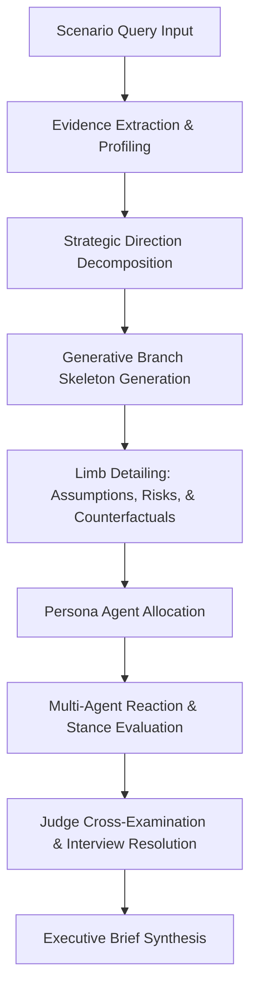

# Project Report: Memtrace Simulith Consequence Engine

## 1. Introduction and Purpose
Memtrace Simulith is a predictive agentic simulation engine built to evaluate strategic scenarios and decisions. It structures queries into decision trees, injects stochastic perturbations/shocks, evaluates stakeholder utility vectors, and runs competitive debates or cross-examinations between simulated persona agents to expose blind spots and hidden assumptions.

---

## 2. Architectural Flow

The execution pathway for a scenario simulation proceeds as follows:



---

## 3. Technical & Algorithmic Details

### A. The LLM Connector System (`callLLM`)
To interact with models, all components consume a standardized signature:
```javascript
export async function callLLM(prompt, temperature = undefined, provider = null, apiKey = null, model = null)
```
The implementation internally resolves default credentials and model configurations from `DEFAULT_CONFIG` when optional parameters are omitted, `null`, or `undefined`. This allows simple, clean invocations like `callLLM(prompt, temperature)` while preserving the capability to override settings.

### B. Consequence Engine Instability-Driven State-Space Search
The consequence tree mode has been migrated to a stochastic dynamical system:
- **Instability Score ($I(S)$):** Determined by the divergence of state variables from equilibrium values, scaled by the variables' outbound coupling coefficients in the interaction network:
  $$I(S) = \text{clamp}\left( \frac{1}{|V|} \sum_{v \in V} \text{divergence}(v) \cdot (1 + \sum \text{outbound\_coupling}(v)), 0.0, 1.0 \right)$$
- **Entropy-Driven Branching:** Local branching factor is calculated dynamically as a function of the parent node's instability:
  $$B_{\text{local}} = \text{clamp}\left( \text{round}(1 + I(S) \cdot (B_{\text{max}} - 1) \cdot 1.5), 1, B_{\text{max}} \right)$$
- **Relative Regret-Based Selection:** Replaces absolute scores with pairwise regret computation across sibling branches to establish competitive pressure:
  $$\text{Regret}(S_j) = \sum_{k \neq j} \sum_{p \in \text{stakeholders}} \max(0, U_p(S_k) - U_p(S_j))$$
  Probability distribution is then computed using a Softmax over negative regrets (logits).
- **Uncertainty Amplification:** Parent state instability propagates into the transition physics engine, scaling the variance of dynamic estimations:
  $$\text{variance}_{\text{amplified}} = \text{variance} \cdot (1 + I(S_{\text{parent}}) \cdot 2.0)$$

---

## 4. Project Roadmap

### What Has Been Completed
- **Instability-Driven Branching:** State-space expansion is now driven by local entropy and variable coupling rather than fixed action widths.
- **Regret-Based Probabilities:** Implemented pairwise regret minimization across siblings to solve absolute utility score stagnation and guarantee realistic stakeholder differentiation.
- **State-Dependent Uncertainty Amplification:** Integrated parent-state instability directly into the transition physics layer to amplify outcome dispersion for volatile paths.
- **Wrapper and Signature Standardization:** Simplified the `callLLM` interface by placing the required positional arguments (`prompt` and `temperature`) first.
- **Internal Configuration Resolution:** Handled optional credential and model parameters internally using `DEFAULT_CONFIG`, removing the need to pass redundant `null` or `undefined` placeholders across callers.
- **KV-Cache Memory Safety:** Implemented explicit sequence disposal (`session.sequence.dispose()`) to clear KV-caches between generations.
- **Tree Mode Telemetry & Token Forecasting:** Implemented accurate token cost prediction for Consequence Trees and integrated real-time `llmCallCount` tracking/polling with the visual frontend telemetry dashboard.
- **Surgically Hardened Narrative Parser:** Modified `explainDominantFutures` in `query_adapter.js` to support case, space, hyphen, and underscore variations in key names, as well as bullet points, markdown bolding, hashes, and custom block markers.
- **Robust JSON Fallback Mapping:** Integrated normalization utility to map uppercase or camelCase keys of parsed JSON arrays and wrapped JSON objects from LLMs into standard lowercase properties.
- **Path-Integrated Utility Score Calculation:** Fixed mathematical error in `extractDominantPaths` where terminal state utilities and transition path probabilities were double-counted/mis-scaled. It now implements a clean, path-integrated expectation calculation that aligns with MCTS search metrics.
- **Comprehensive Parser Unit Testing:** Created `test/query_adapter.test.js` covering multiple parser formats and expected utility calculations.
- **Test Alignment:** Jest assertions and the Consolidated Orchestration Suite validated cleanly with zero errors.
- **Alibaba Cloud Hackathon Infrastructure:** Implemented Qwen Hackathon compliant CI/CD deployment scripting (`deploy.sh`) and instructions (`README.md`) within `memtrace_cicd/memtrace_AB` for automated Docker Compose provisioning on ECS/SAS instances.

### What is Currently in Progress
- **Monitoring Production Logs:** Verifying the reliability of the offline model under continuous concurrent request loads.

### What Remains to Be Done
- **Multi-Tenant PostgreSQL Migration:** Move away from local SQLite storage to multi-tenant postgres schemas.
- **WebSocket Streaming Interfaces:** Establish live state mutation broadcasts for visual dashboards.
- **WASM Memory Optimization:** Reduce the browser extension's WASM footprint.


