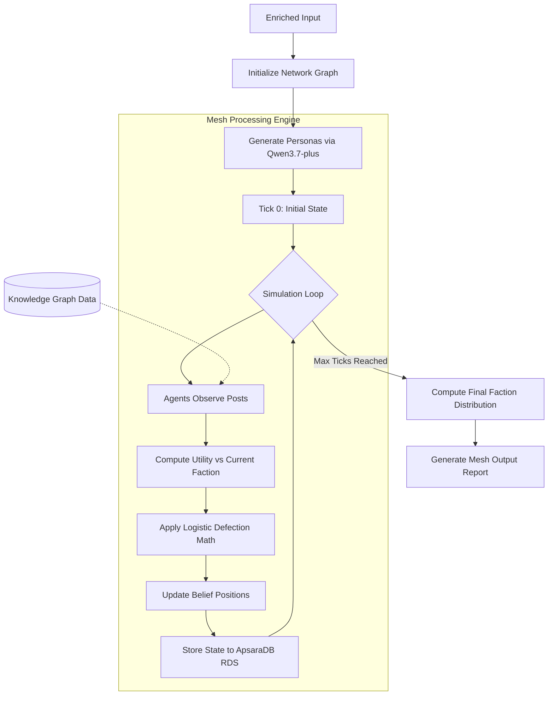
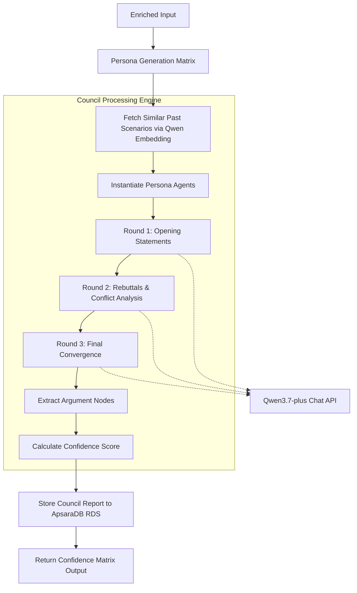
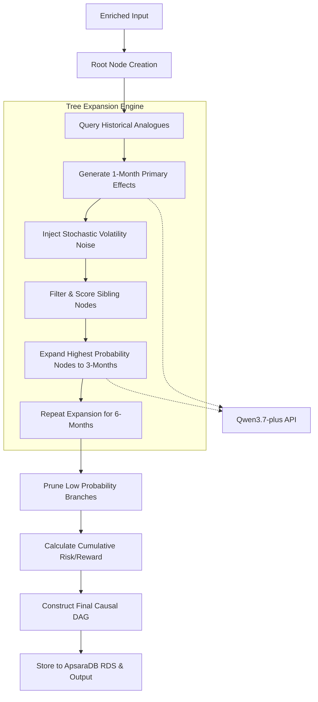
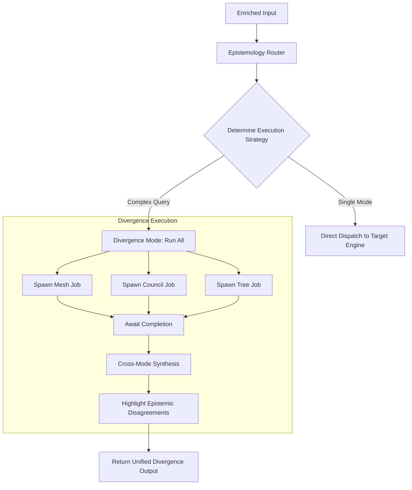
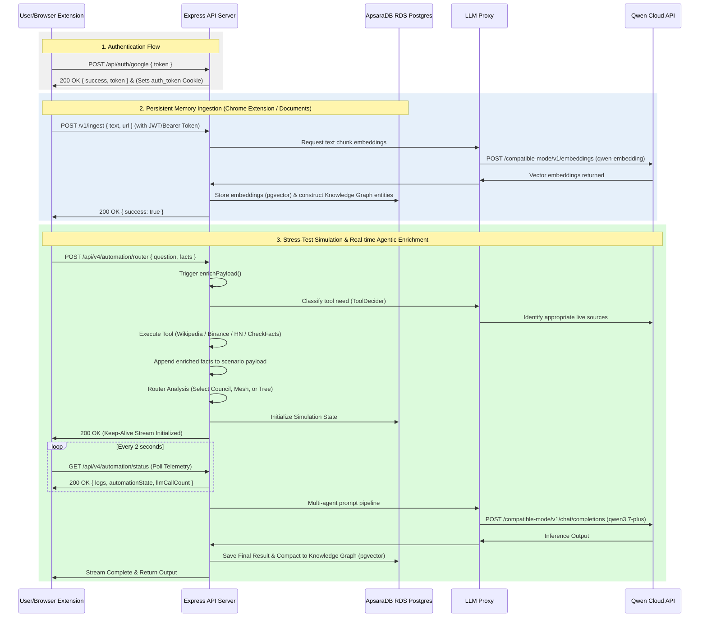
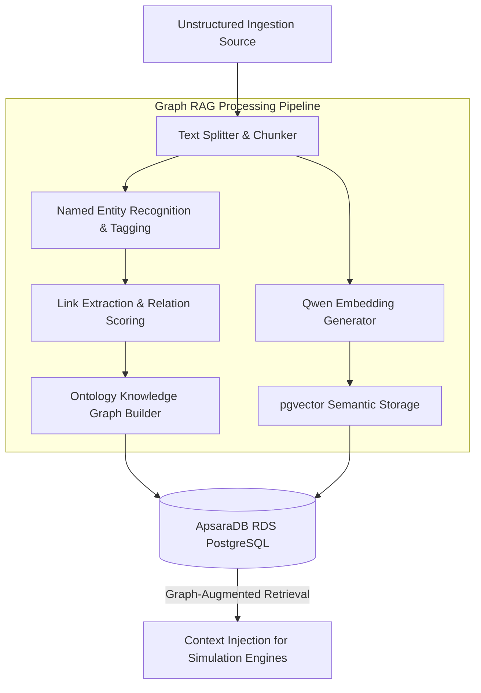
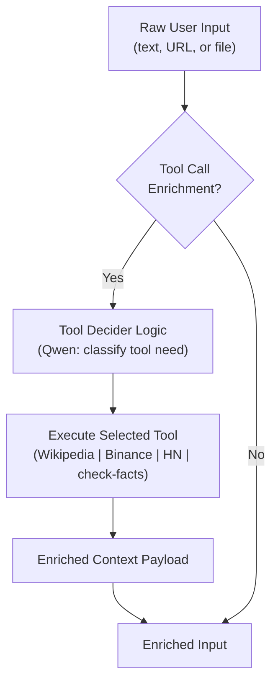

# Architecture Diagrams

This document contains detailed architectural flows and mathematical formulations for Simulith's core systems.

---

## 1. Mesh Mode Architecture

**TL;DR**: Mesh mode simulates how narratives and beliefs propagate through a social network. It generates autonomous agents with starting beliefs, introduces a scenario (narrative shock), and computes how beliefs drift and factions form based on logistic defection probabilities.

### 🧮 Formulations:

* **Belief Update Logic**:
  $$
  \Delta \text{position} = \frac{(\text{authorStance} - \text{currentPos}) \times \text{postWeight}}{\text{resistance}}
  $$
* **Logistic Defection Probability**:
  $$
  P(\text{defect}) = \sigma(\Delta U \times \text{temperature})
  $$

### 👤 Custom Persona Integration:

Mesh mode accepts custom user-defined personas. When a custom description is provided, it is parsed by Qwen into a structured archetype, assigned a platform focus, and injected directly into the network seed pool. This custom agent then posts, interacts, and updates its beliefs dynamically based on the network's narrative shocks.

### 📈 Processing Flow:

---

## 2. Council Mode Architecture

**TL;DR**: Council mode creates an expert panel of diverse AI personas (e.g., Skeptic, Optimist, Regulator) to debate a user's scenario. They argue, rebut, and ultimately converge on a weighted confidence score.

### 🧮 Formulations:

* **Confidence Scoring**:

  $$
  C_b = \text{clamp}(\text{confidenceBase} + \text{support} \times 4 - \text{risk} \times 3 + \text{supportCount} \times 6 - \text{pushbackCount} \times 6 - \text{contradictions} \times 2, 5, 95)
  $$

  *(where $C_b$ is the confidence index of strategic branch $b$, penalizing contradictions and pushbacks while rewarded by structured supports)*

### 👤 Custom Persona Integration:

Council mode fully integrates custom personas. The user's unstructured role description is mapped by Qwen into numeric trait parameters: `riskBias` (inverse of tolerance), `evidenceDemand`, `noveltySeek` (derived from risk and evidence requirements), and `clarityNeed` (derived from evidence demand and reasoning style). These traits explicitly govern the persona's debate bias, prompting them to support or push back against strategic alternatives during cross-examination.

### 📈 Processing Flow:

---

## 3. Tree Mode Architecture

**TL;DR**: Tree mode explores the causal consequence cascade of a decision. It acts like an MCTS (Monte Carlo Tree Search), building a DAG (Directed Acyclic Graph) of what happens 1, 3, and 6 months down the line.

### 🧮 Formulations:

* **Stochastic Volatility Integration**:

  $$
  S_{t+1} = S_t + \Delta_{\text{elastic}}(S_t, O) + \Delta_{\text{sampled}}(\theta \sim \mathcal{N}(0, \sigma^2)) + \Delta_{\text{interaction}}
  $$
* **Minimax Regret Selection Probability**:

  $$
  p_i = \frac{\exp(\text{score}_i / \tau)}{\sum \exp(\text{score}_j / \tau)}
  $$

  *(where $\tau$ represents the exploration temperature controlling branching entropy)*

### 📈 Processing Flow:

---

## 4. Router & Divergence Architecture

**TL;DR**: The Orchestrator layer. The Router automatically parses the user's prompt to detect which simulation mode is best. The Divergence engine can run all three modes concurrently and synthesize their differing conclusions into a unified insight.

### 📈 Processing Flow:

---

## 5. Request Flow (End-to-End)

**TL;DR**: The full lifecycle from client browser, through the Express API proxy, interacting with Qwen Cloud and the database layer.

---

## 6. Memory Substrate (Graph RAG Engine)

**TL;DR**: The Memory Substrate functions as a production-grade Graph RAG system. It ingests unstructured text, chunks it, generates embeddings using `qwen-embedding`, extracts semantic entities and relationship nodes, and saves them to a relational knowledge graph.

### 🧮 Formulations:

* **Vector Semantic Retrieval**:

  $$
  \text{Similarity}(A, B) = \cos(\theta) = \frac{A \cdot B}{\|A\| \|B\|}
  $$

  *(used to match current queries against historical memory vectors)*

### 📈 Processing Flow:

---

## 7. Agentic Tool-Calling Pipeline

**TL;DR**: The decision engine employs a dynamic, multi-agent tool execution model where agents can autonomously decide to fetch live reality data or background encyclopedic/market references before generating simulation outputs.

### 📈 Processing Flow:

